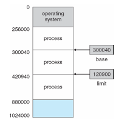

Main Memory - ch8
==================
### Background
Program is brought from disk into memory and placed within a process for it to be run.

CPU can only access main memory and registers. To access disk, CPU has to indirectly run instructions to put disk in main memory or registers.

Memory unit sees everything as a stream. The 2 things that are on this stream are  
  * read requests (contains address to read)
  * write requests (contain address to write to and data to write)

Register access is usually just 1 clock cycle. Main memory is much slower. This can lead to a **stall** where the CPU simply delays executing instructions.

Cache sits between main memory and CPU registers. It serves to make it so that stall time is less.

Protection of memory is required to ensure correct operation

### Base and Limit Registers
The logical address space is made up of **base registers** and **limit registers**. CPU checks every memory access made in user mode to make sure that the address is between the bast and limit for that user.
  * base register - minimum memory address user can access (closer to 0)
  * limit register - maximum memory address user can access (closer to max memory address possible)

  * shows how hardware addresses are protected using the base and limit registers  

### Address Binding

input queue -

binds -

* compile time
  * absolute code -
* load time
  * relocatable code -
* execution time

##### Logical vs. Physical Address Space
logical address -

memory-address register -

physical address -

virtual address -

logical address space -

physical address space -

differences between logical and physical addresses
  *
  *

memory-management unit (MMU) -

relocation register -

##### Dynamic Loading
##### Dynamic Linking and Shared Libraries
dynamically linked libraries -

static linking -

stub -

shared libraries -

### Swapping
swapped

backing store

##### Standard Swapping
ready queue -

double buffering -

##### Swapping on Mobile Systems
application state -
### Contiguous Memory Allocation

##### Memory Protection
transient

##### Memory Allocation
partitions

multiple-partition method

variable-partition

hole

dynamic storage allocation problem

* first-fit
* best-fit
* worst-fit

##### Fragmentation
external fragmentation
50-percent rule
internal fragmentation

compaction -

### Segmentation
##### Basic Method
##### Segmentation Hardware
### Paging

##### Basic Method
frames -
pages -
page number
page offset
page table

framing table

page sizes are always powers of 2 because ...

##### Hardware Support

registers

page-table base register

translation look-aside buffer (TLB)

TLB miss

wired down

address-space identifiers (ASIDs)

flushed -

hit ratio

effective memory-access time

##### Protection
valid-invalid bit

page table length register
##### Shared Pages

reentrant code (pure code)

### Structure of Page Table

##### Hierarchical Paging

forward-mapped page table

##### Hashed Page Tables
hashed page table

clustered page tables

sparse

##### Inverted Page Tables

##### Oracle SPARC Solaris
### Example: Intel 32 and 64-bit architectures
##### IA-32 Architecture
##### IA-32 Segmentation
##### IA-32 Paging

##### x86-64
### Example: ARM Architecture

### Summary
hardware support -
performance -
fragmentation -
relocation -
swapping -
sharing -
protection

##### Review Questions Answered
1
2
3
4
5
6
7
8
9
10
11
12
13
14
15
16
17
18
19
