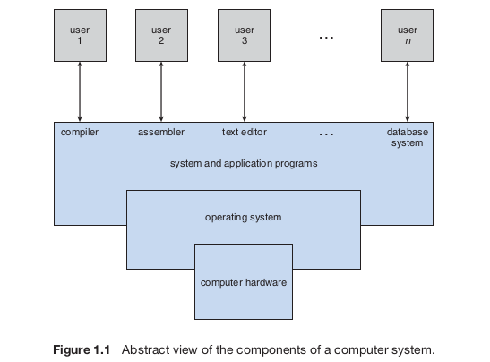

Chapter 1 - Introduction
=========================
Operating system is a program that manages a computer's hardware.

### What Operating Systems do

OS manages hardware, CPU, memory, IO device, and application programs. It provides an environment for all of them to work.

OS is the one program running at all times on the computer - usually called the *kernel*.  
*System programs* - programs associated with OS but necessarily part of the kernel.  
*application programs* - all programs not associated with OS.  
*middleware* - software frameworks that provide additional services to application developers.

### Computer-System Organization
When computer starts, a *bootstrap program* is run that starts the OS. The bootstrap program is stored in either read-only memory(ROM) or electrically erasable programmable read-only memory (EEPROM). EEPROM is also called *firmware*. This bootstrap program
* initializes CPU registers
* initializes devices controllers
* initializes memory
* load OS
* start executing OS
* starts system processes/system daemons
In order to accomplish all this, bootstrap program locates OS kernel and loads it into memory. Then, it executes the OS. It also does the same for system processes or system daemons. On UNIX, the first system process is "init" which starts many other daemons.

Once the OS and system daemons are loaded, the system waits for events. Events are signaled using *interrupts*. Hardware triggers interrupts by sending a signal to the CPU via the system bus. Software triggers interrupts using a *system call* operation. When an interrupt occurs, the OS stops its current work, and starts running the appropriate handler code for the interrupt. To determine the appropriate handler, the OS looks to a *interrupt vector* which maps interrupts to the address of the interrupt handler. The interrupt vector and the interrupt handlers are usually stored in the first hundred or so locations in memory.

##### Key Terms
*firmware* = EEPROM memory from where startup programs and other system programs are stored.  
*middleware* = software frameworks that provide additional services to application developers.
*system processes/system daemons* = processes that are outside of the kernel that run the entire time the kernel is running.
*interrupts* = signal events in to the OS from either the hardware or the software  
*system call/monitor call* = software uses these operations to send interrupts to the OS.   
*interrupt vector* = 
