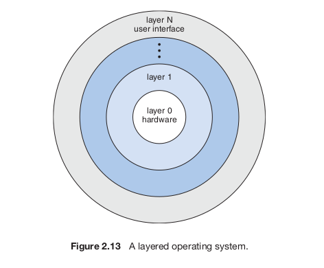

Chapter 2 - Operating System Structures
=========================================

### Operating System Services
Operating systems have the following services in order to help use do work:
* user interface
* program execution - load program into memory and run it
* io operations
* file-system manipulation
* communications between processes. This is done either via shared memory or message passing
* error detection

Operating Systems have the following services in order to make the OS efficient:
* resource allocation
* accounting - track which users are using what amount of resources
* protection and security

### User and OS interface
Command interface (shell) or graphical user interfaces are ways to communicate with the OS.

### System Calls
System calls provide an interface to services made available by an OS.

An application programming interface (API) is used to determine which functions an applications programmer can use to affect the OS. 3 common APIs are
* POSIX API
* JAVA API
* libc library for C programs

Each of these APIs for application programmers end up actually just calling a system function under the hood.

There are 6 major types of system calls:
* process control
* file manipulation
* device manipulation
* information maintenance
* communications
* protection

### OS Structure

##### Simple Structure
Unstructured systems like MS-DOS and early unix kernel existed because at that time, things were very primitive. All the code was shoved into one file and this is bad. We instead want a modular design.

##### Layered Approach

The advantages of this system are:
* simplicity of construction and debugging
* each layer uses functions and services of only lower-level layers
* when constructing each layer, you assume that the lower layers are correct. So you only have to test the current layer. You continuously test the current layer until you know that it is correct and then only do you move onto a higher layer
* a layer does not need to know HOW a lower layer works
* the data structures, operations, and hardware are hidden from a higher level layer

The disadvantages of this system are:
* defining a layer can be difficult
* careful planning to determine which layer should contain what is necessary (eg. device driver for backing store must be lower level than memory management routines)
* less efficient since you have to go down entire hierarchy to find appropriate functions to do a simple task. (eg. a user executes io, which calls io call in io layer, which calls memory management layer, which calls CPU scheduling layer, which calls hardware. Each layer adds overhead to the original io call.)  
