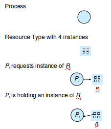
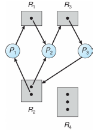
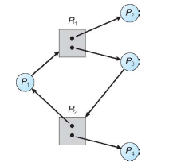

Deadlocks
==========
Resources are things that a thread would use. Each resource R has W instances. A thread processes a resources by
  1. requesting the resource
  2. using the resource
  3. releasing the resource

### 4 conditions that MUST be true for a deadlock to occur
* Mutual exclusion - only one process at a time can use a resource
* Hold and wait - while a process holds a resource, it is also waiting to acquire additional resources
* No preemption -  a resource can be released only voluntarily by the process holding it, after that process has completed its task
* Circular wait - P0 is waiting for P1, P1 is waiting for P2, P2 is waiting for P0.

### Resource-Allocation Graph

  * this graph has a deadlock
  * Mutual Exlcusion: assume true
  * Hold and wait:
    * P1 holds R2 and is waiting for R1.
    * P2 holds R1 and R2 and is waiting for R3
    * P3 holds R3, and is waiting for R2
  * No Preemption: assume true
  * Circular Wait:
      * P1 is waiting for P2
      * P2 is waiting for P3
      * P3 is waiting for P1

  * no deadlock, even though there is a Circular wait
  * Assume mutual exclusion and no preemption
  * hold and wait:
    * P1 is waiting for R1 and holds R2
    * P3 is waiting for R2 and holds R1
  * circular wait:
    * P1 is waiting for P3
    * P3 is waiting for P1
  * THUS, the 4 conditions of Deadlock are TRUE. HOWEVER, still no deadlock. Thus, the 4 conditions are necessary for a deadlock, but DO NOT imply deadlock.

### Key Hints
If graph has no cycles -> no deadlock

if graph contains a cycle ->
  * if only 1 instance per resource type -> deadlock
  * if several instances per resource type -> potential for deadlock

### Handling Deadlocks
You can ensure that a Deadlock never occurs via *deadlock prevention* techniques or *deadlock avoidance* techniques.

You can recover from a deadlock

You can just pretend that a deadlock will never occur. Most OS's do this. Unix does this. This is cray-cray.

### Deadlock Prevention
You can restrain the ways a request n be made. 
