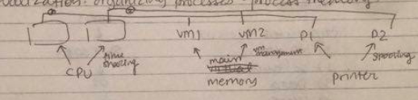
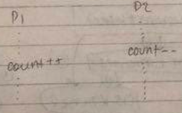

Lecture 1 - Intro to OS
============================
What is inside a Computer System?  
  * hardware
  * software
  * data
  * users

Layers of a computer system  
  * Applications (users and utilities)
  * Libraries
  * OS kernel
  * hardware

1) Applications use libraries  
1') Libraries can access OS kernel  
2) Applications can accesses OS kernel directly  
3) applications can access hardware

unix/linux: 1, 1'  
windows: 2  -   this makes it so that if you change kernel, then application must be changed as well. This is why windows is bad.
both: 3 - assembly programming - allows you to access hardware. nonprivileged instructions.

##### mode bit    
Determines whether the current instruction is for user or for kernel. If user mode, then we check whether current user can do whatever action it wants to do. Kernel mode allows you to functions where the kernel is affecting the hardware. All other things are within user mode.  
0=kernel mode  
1=user mode  

In kernel mode, you can
* change system timer

In user mode, you can
* change registers

Shells run in user mode

### Three major concepts performed by OS: abstraction, virtualization, concurrency

Three key things done by OS:
* abstraction
* virtualization
* concurrency

#### abstraction
Abstraction allows you to add layers on top of one another. It allows you to work at higher levels once you finish a lower level, thus leading to faster code and development time.

An example of abstraction is the read function.

##### read(file1, logic_block_number, memmory)
This simple seeming read function actually does a lot of stuff. Note that the shell is in user mode in this example. The layers of abstractions are:
* compute position of logic_block_number
* move read/write head to corresponding disk track
* check for seek errors
* read physical block into buffer
* check for read errors
* copy block to memory from the buffer

Each one of these steps does a lot of stuff internally, thus adding even more layers.

#### virtualization
Virtualization is a single piece of hardware that acts as though there are multiple by creating a virtual entity for each process.
* timesharing: one CPU can be shared by multiple processes by splitting into multiple virtual CPUs.
* virtual memory management: virtualization allows each process  to have its own memory, splitting main memory into numerous chunks

An example of virtualization is in the above picture where the original CPU creates 2 virtual CPU's. Each virtual CPU is connected to 1 virtual machine and to 1 printer.

spooling (for printing): a type of buffering for the printer. Placing a print job into a queue for extended or later processing. Thus multiple different processes can write to the queue without waiting and whenever the printer is available, it will go ahead and do the appropriate printing function.

#### instruction level concurrency
Concurrency is basically making multiple things happen at the same time. Interweaving processes at the assembly level can cause *race conditions*, where something is edited twice and the changes aren't synchronized correctly.

Process 1 increments count, while process 2 decrements count.
The assembly for process 1 would look like
* (1) load: r1 <- count
* (2) increment: r1 <- r1+1
* (3) store: count <- r1
The assembly for process 2 would look like
* (1') load: r2 <- count
* (2') decrement: r2 <- r2-1
* (3') store: count <- r2

Assume count is initially 3. If P1 ran then P2 ran, count would be 3. If P2 ran then P1 ran, count would be 3.

Instruction level concurrency is about running the assembly instructions concurrently so they still result in the same answer. This is a difficult thing to do. The above would not work with instruction level concurrency. An example that shows that you cannot just interweave the assembly instructions above is:

(1) (2) (1') (2') (3) (3') which is:
* (1) load: r1 <- count       ; count=3, r1=3
* (2) increment: r1 <- r1+1   ; count=3, r1=4
* (1') load: r2 <- count      ; count=3, r1=4, r2=3
* (2') decrement: r2 <- r2-1  ; count=3, r1=4, r2=2
* (3) store: count <- r1      ; count=4, r1=4, r2=2
* (3') store: count <- r2     ; count=2 , r1=4, r2=2

Thus this interleaving would make count=2 when count should be 3.
