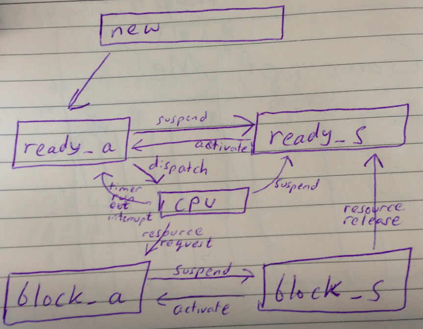
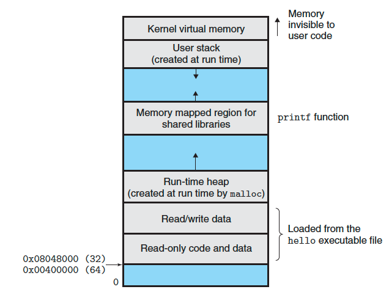

Lecture 5
=============

### Basic States

The above diagram shows all the different states that a process is in.
Things to note from diagram
* from *new state*, you go directly to *ready_a state*
* *suspend* and *activate* between ready sub states and block sub states are same
* The key thing that we think about is the ready_a and CPU state transition. The transitions are *dispatch* and *timer run out interrupt*.
* The CPU can suspend a process by sending it to the ready_s state
* *resource request*  - process needs to wait for some resource
* *resource release*  - ???

States:  
1. new - process starts here
2. ready - process can be run, but is waiting for CPU
  * ready_a - ready, and activated
  * ready_s - ready, but suspended
3. block - process
  * block_a - waiting for io, still in memory
  * block_s - waiting for io, put in disk

There is a hierarchy of states. You want to be in the CPU state, but you move up and down the other states in order to eventually get there. There are simply rules for when you go form a higher state to a lower state (eg. too many processes in an active sub state, waiting for io). How do you move up? There is a priority assigned to each process. There are complex rules for how priority is assigned, but a simple concept is that the priority increases as the process gets older. This assures that a process won't be stuck for too long in a suspended sub state.

Note that this 5 state example is sort of the generic example. OS's will generally follow this 5 state example, but may combine states.

### New state
The process has just been created. It only has a process id (pid).

### Ready state
If a process is in the ready state, it
* has been moved into memory
* has a pid
* has available resources
Ready state has ready_a and a ready_s sub states.

##### ready_a
State has everything except CPU. It has all the resources that it needs.

##### ready_s
A process can be suspended from the ready_a state. You suspend processes if
* they have *run away* - the process keeps on running without stopping
* system wants to check if a deadlock has occurred
* you want to debug the process
* you want to balance CPU bound and IO bound processes

A run-away process can occur if there is a infinite loop within the process.

Sometimes ready_a has too many processes. There are two types of processes - *CPU bound* and *IO bound*. You generally want to make sure that there is a balanced number of the two types of processes. If the balance is off, you have too many processes of a certain type. In order to make it balanced again, you can suspend processes. Suspending processes involves sending the process

### CPU state
The *scheduler* schedules a process to go to the CPU state from the ready state. The *dispatcher* does the appropriate context switch to make it happen.  

In the CPU state, a process gets a small bit of time, called *quantum*, to run. When time runs out, the timer raises a *timer run-out interrupt*. The handler for this interrupt then moves the process out of the CPU state and moves it into the ready_a state.

### Block state
A process goes in the Block state when it is waiting for some resource (io devices, file, ...). This is why when a process goes from the CPU state to the block_a state, it is called a *resource request*.

##### block_a
The process is still in memory at this time.

The process is waiting for a specific device. The process joins a *queue* as it waits for a given device. There is a *queue* for each device.

#### block_s
The process is put on the disk when it is in block_s state.

The reason you want to move a process from block_a to block_s is that in block_a, the process is just wasting space in memory while waiting for IO.

Processes in block_s have very low priority.

A batch process is an example of a that is likely going to be in block_s.

### State transitions Summary
* new -> ready_a : process has resources and is inside memory
* ready_a -> ready_s : too many processes in ready_a, unbalanced IO-bound and CPU-bound processes, debugging, run away process, monitor processes, check for deadlock
* ready_s -> ready_a : no ready_a processes in main memory, process in ready_s has higher priority than any process ready_a
* ready_a -> cpu : scheduler
* cpu -> ready_a : timer run out interrupt
* cpu -> ready_s :
* cpu -> block_a : resource request
* block_a -> block_s : wasting memory, process in CPU state wants to use more memory, scheduler determines that it wants to run some ready_a process but to do so more memory is required
* block_s -> ready_s : desired resource is attained (resource release)

### schedulers
* long-term scheduler - if you have a lot of new processes being created, then they remain in the new state. A long-term scheduler determines which of these processes to put into the ready_a state.  
* intermediate-term scheduler - suspended substates to active substates
* short-term scheduler - ready_a to cpu state

### Linux (4 states)

This diagram shows process states in Linux.

* linux only has 4 process states (there are 6 states shown, however zombie and orphan don't count)
* running is the desirable state
  * it is both the ready_a and cpu state of the model
  * *timer run out interrupt* and *dispatch* both occur in this state. When these events occur, the process remains in this state.
* interruptable is congruous to block_a
* stopped is congruous to block_s and ready_s

##### ZOMBIES!!!!
When a process terminates, it's resources are deallocated by the OS. However, its entry in the process table remains there until it's parent calls wait().

*Zombie state* is when a child process calls exit() before its parent invokes wait(). When this happens, the child's entry in the process table remains there, even the child does not actually exist. As soon as the parent calls wait, these resources are released.

*Orphan state* is when the parent does not wait() and just exits. The child process no longer has a parent. Thus it is an orphan. This condition is bad. Linux handles this by sending all orphan processes to the *init process*, which then calls wait() for all the orphans.

##### init process
init process is first process created on linux

It probably does lots of things, but for now, just know that it's job is to terminate orphan processes by calling wait() on them.

### Virtual Address Space

stack is used for function calls

heap is for dynamically allocated memory

### Process Context-Switch
This is fundamental to *multiprogramming* - multiple programs in memory.

To do process context-switch, you have to
1. You have to save PCB for preempt-to-be process (done by dispatcher)
2. Then, restore PCB for dispatch-to-be process (done cooperatively by dispatcher and scheduler). Scheduler provides process.

Context has:
1. unique ID of the process (PID)
2. pointer to parent process
3. pointer to child processes
4. priority of process (for cpu scheduling)
5. register save area - area used to save registers
6. whether the processor is running or not
7. list of open files (file descriptor of each open file)
8. current position of stack pointer
9. current position of heap pointer
10. house keeping information (eg. cpu computing time. things that can help you determine priority. If high cpu computing time, then you have  )

### passive termination
exit()
### active termination
done by parent. parent checks status. you can call wait

### network
interprocess communication (IPC) is implemented on multiple nodes on network

2 approaches to do IPC:
1. shared memory approach.
2. message passing

*Shared Memory Approach*  
For example, say you have a producer-consumer problem. A buffer pool (DIAGRAM) can be used to

struct{

} item;
const in BUFFER_SIZE = 10;
item buffer[BUFFER_SIZE];
item next_item_produced, next_item_consumed;

the producer process:  
while(true){
  while( (in+1) % BUFFER_SIZE == out); //just waits. a way to waste cpu time.  [(n-1)+1] % 10 = 0. UNDERSTAND how to check fullness.  
  buffer[in] = next_item_produced;
  in = (in+1) % BUFFER_SIZE;
}

the consumer process:  
while(true){
  while(in == out);
  next_item_consumed = buffer[out]; // buffer is full so wait
  out = (out+1) % BUFFER_SIZE;
  // consume the item
}

in is a shared memory location. You don't want to do this.
you cannot use a counter either. Same shared memory issues occur.

*message passing*  
producer process:  

    while(true){
        // produce a item in item_message
        send(consumer_id, item_message);
    }

consumer process:  

    while(true){
      receive(producer, item_message);
      // consume the item in item_message
    }
