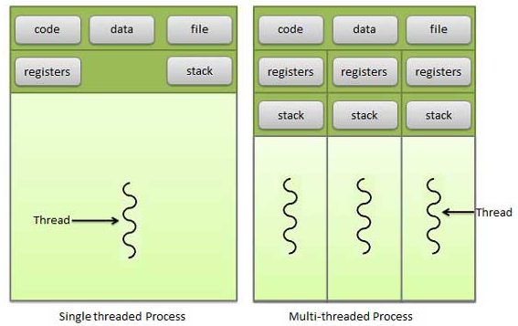
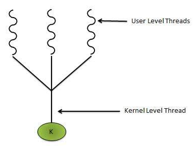

Lecture 7 - threads
==============

A thread is one of the independent tasks that a process can perform. You can have multiple threads running concurrently.

A thread is inside the address space of a process. Thus multiple threads can all easily share memory.

### Process vs. Thread
|Process|Thread|
|---|---|
|heavy weight/resource intensive|light weight/uses fewer resources|
|process switching requires interaction with OS|thread switching does not need OS|
|each process has its own memory and file resources|threads share memory and file|
|if one process is blocked, then no other process can execute until first process is unblocked(by preempting it)|while one thread is blocked and waiting, a second thread in the same process can be run|
|multiple processes without using threads use more resources|multiple threaded-processes use fewer resources|
|a process operates independently of others|one thread can read,write, or change another threads data|

### User level threads
User managed threads

kernel is not aware of the existence of threads. There is some thread library that the programmer uses to create, update, pass messages between, scheduling thread execution, destroying, and restoring threads.

A given application begins in a single thread and begins running in that thread.

##### Features of User Threads
* thread switching does not require kernel mode
* can run on any OS
* scheduling can be application specific
* user level threads are fast to create and manage

### Kernel level threads
OS managed threads acting on kernel. Thread management done by kernel. There is no thread management code in application area.
Scheduling is done by the kernel on a *thread basis*.

Kernel threads are generally slower to create and manage than user threads.  

##### Features of Kernel threads
* kernel can simultaneously schedule multiple threads from the same process on multiple processes
* if one thread is blocked, kernel can schedule another thread of the same process
* slower to create and manage than user threads
* transfer of control from one thread to another within same process requires a mode switch to the kernel

### Benefits of threads
* Responsiveness - allow continued execution if part of process is blocked
* Resource Sharing - share resources of process
* Economy - low overhead to create, less expensive than context-switching
* Scalability - scales with multiple process

### What does a thread contain?
Each thread has its own
* PC
* stack
* registers

### What does a thread share?
Threads share
* files
* code
* ...

### Paradigms for using threads
1. specialist paradigm
2. client server paradigm
3. assembly line paradigm

##### specialist paradigm
Each thread is a specialist. There are multiple identical threads.

Useful in cases such as

    for(i: 0...100)
      c[i] = a[i]+b[i]

You can create a thread for each i:0-20, another thread for 21-40, ...

Thus in 5 threads, you can do

This is called *SIMD (single instruction stream, multiple data streams)*.
* each thread is doing a single instruction set
* there are multiple different data inputs. Each thread gets its own data stream
* this is also called *vector processor architecture*

##### client server paradigm

Various clients can be loaded onto various servers:
* client 1 loaded onto server 1
* client 2 loaded onto server 3
* client 3 loaded onto server 2

An example of this is a word processor. Multiple threads can run concurrently. Word processor has threads:
* user input
* spell/grammar checking
* document layout
* ...

##### assembly line paradigm
Input goes from state to state. Each state represents a thread in this case

    task -> thread 1 -> thread 2 -> thread 3 ->

This is basically pipelining. You can also call this *assembly parallel*.

An example of this is a compiler. When creating a compiler, you have 2 passes (in this example).
* pass 1: creates symbol table
* pass 2: symbol table
* pass 3: object code

You can have a thread for each pass. Since the passes have a assembly order, your threads also must have an order.

### Approaches to implement multi-threaded programs
* many to one
* one to one
* many to many

##### many to one  

There are multiple threads running in a process in user mode. They are all mapped onto one kernel thread.

When a thread makes a blocking system call, the entire process will be blocked. Only one thread can access the Kernel at a time, so multiple threads are unable to run in parallel on multiprocessors. This effectively means that you cannot do things fully in parallel.

It is difficult to determine which thread should get CPU time. The CPU doesn't know about the threads in a given process, thus can't use the CPU scheduler which very effectively handles concurrent processes.

If you use many to one approach, you do not have to change the kernel because the kernel is not doing anything special. The kernel technically just has a main thread which is basically like having no threads.

The **run time system (RTS)** determines which thread to run when a process gets CPU time. RTS makes a schedule for each thread.

Interestingly, if a given thread needs resources (eg. IO), then you would think that it makes sense to just switch threads on that process. However, recall that requiring resources means that your entire process is preempted. Thus, in many to one approach, you end up basically not using threads concurrently.

**Scheduler activation** - scheduler will activate threads.
When a given thread requires resources, then the process scheduler is supposed to preempt this process and run another. If you use scheduler activation, however, the scheduler sends a *upcall* to the process instead of immediately switching processes. The current process then checks to if there is another thread that can be run in this given process. If so, then the scheduler does not switch processes, and the current process simply changes which thread is running. If there are no threads that can be run at this time, then you just go ahead and switch processes.

The problem with many to one is that concurrency is low.
An example of an OS that does this is solaris.

##### one to one

one user thread maps to one kernel thread.

Thus when a given user thread needs resources, you can go ahead and preempt this process and

This means concurrency is high.

It is slow to create a kernel thread for every user thread thus usually there is some limit to how many threads a given process can have in this approach.

Disadvantages of one to one
* kernel has to be modified
* can't create too many threads
* lots of data structures created for each thread

##### many to many
many user level threads multiplexes to the Kernel thread of smaller or equal numbers.

developers can create as many user threads as necessary and the corresponding Kernel threads can run in parallels on a multiprocessor.

This requires modifying kernel.

You need a run-time system to work with multiple user threads to determine which user threads to work with the kernel threads.

This is compromise between many-to-one and one-to-one.

### Allocation of CPU to process and threads
It is difficult to determine which thread should get CPU time. The CPU doesn't know about the threads in a given process, thus can't use the CPU scheduler which very effectively handles concurrent processes.

### Example thread code

    int sum; //in global space. inter-thread sharing
    int main(int argc, char * argv[]){

        pthread_t tid;

        // p_thread has attributes. These attributes are things like priority, scheduling policy, ...
        pthread_attr_t attr;
        pthread_attr_init(&attr);

        //runner function is run with a single parameter
        pthread_create(&tid, &attr, runner, argv[1]);

        //join thread with main thread. This effectively stops the thread.
        //join is a *blocking* call, meaning that the main thread has to wait until the
        //child thread is stopped. Thus, join = wait and stop_child for main thread.
        //pthread_join knows when that the child is stopped when the child calls pthread_exit
        pthread_join(tid, NULL);

        printf("sum=%\n", sum);
    }

    void * runner(void * param){
      int upper = atoi(param);
      sum = 0;
      for(int i=0;i<=upper; i++){
        sum += i;
      }
      //pthread_exit means that the thread is done
      //0=executed successfully.
      pthread_exit(0);
    }

### Example creating multiple threads

    //creates multiple threads.
    //id of each is stored in tid array
    pthread_t tid[len];

    for(int i=0; i<len; i++){
      pthread_create(&tid[i] ,NULL, runner, NULL);
    }

    //stop threads
    for(int i=0;i<len;i++){
      pthread_join(tid[i], NULL);
    }
