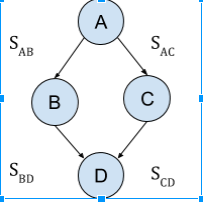

Lecture 9 - Semaphores
==========

### Semaphores

A semaphore is a synchronization tool that is more sophisticated than mutex locks for processes.

Can be named or unnamed.

##### Unnamed semaphores
Unnamed semaphores (lacking any name or handle to locate them) must exist in some pre-existing, agreed upon memory location. This location must be accessible (therefore is shared memory) by both processes.

Usual shared memory places for the unnamed semaphore to be
* inherited by children after fork in the case of child processes
* global variable or the heap in the case where they are shared between threads of a single process.

The essential thing here is that the code in parent, child, or threads already knows the address of the semaphore.

##### Named semaphores
Named semaphores are necessary for unrelated processes.

For example, producer/consumer might be not share any address space with each other at all, but may have to share some resource that needs to be protected by a semaphore. The named semaphore gives them a path to the semaphore.

There are two types of semaphores - general(counting) and binary semaphores.

*General (counting) Semaphores* can be initialized to any #. They are for resource allocation (i.e. if only 6 processes can access printer at the same time)

*Binary Semaphore (mutex lock)* - integer value can range only between 0 and 1. The good thing about this is that it has mutual exclusion - only a single process or thread can use the resource. Binary semaphores require no initialization - set to 1 (free) by default.

You can use a counting counting semaphore to implement a binary semaphore.

##### knowing when to use named semaphores versus unnamed semaphores
You can use a named semaphore in all scenarios. However, named semaphores require extra work because you have to deal with the paths and permissions.

This becomes dumb if you have easily shared memory already available to you, like in the case of threads. Thus, as a general rule, you use
* unnamed for threads & related processes
* named for unrelated processes

#### one way to implement semaphores

A semaphore is just a struct with the count and queue.

    struct {
      int count
      queue q
    } semaphore S

A semaphore is accessed via two atomic operations
* wait (also called P())
* signal (also called V())

##### definition of wait function

    //wait
    void p(semaphore s) {
        s.count--;
        if(s.count < 0) {
            // place process in s.queue
            // block process(block state of a process)
        }
    }

##### definition of signal() function

    //signal
    void v(semaphore s) {
        s.count++;
        if(s.count <= 0) {
            // remove a process p from s.queue
            // place process p on ready list(i think ready list is referring to the process state)
          }
    }

##### Example of Semaphore use

    //decleare and initialize semaphore
    semaphore s;
    s.count = 1;

    process 1
      …
      while(1) {
          …
          p(s); //wait (entry section)
          x++;  //critical section
          v(s); //signal (exit section)
          …     // remainder section
      }
      …

    process 2
      …
      while(1) {
          …
          p(s);  //wait

          x--;   //critical section

          v(s); //signal
          …
      }
      …

##### example using 2 semaphores
This example uses 2 semaphores. In this specific scenario, there is a deadlock

    //decleare and initialize semaphore
    semaphore s1;
    s1.count = 1;

    semaphore s2;
    s2.count = 1;

    process 1
      …
      while(1) {
          …
          p(s1); //s1.count=0, s2.count=1
          p(s2); //waiting for s2

          x++;  //critical section

          v(s1); //signal (exit section)
          v(s2);
          …     // remainder section
      }
      …

    process 2
      …
      while(1) {
          …
          p(s2);  //s1.count=0, s2.count=0
          p(s1)   //waiting for s1

          x--;   //critical section

          v(s2); //signal
          v(s1);
          …
      }
      …

##### semaphore dependencies within processes

  
Image 1: Arrows denote dependencies; B and C cannot occur until A finishes. S_{AB} is a semaphore

Assume all semaphores are initialized to 0.

code for each process to attain the synchronization in picture.

    // note: p=wait, v=signal, ... code specific to that process
    A
      …
      v(SAB)
      v(SAC);

    B
      p(SAB)
      …
      v(SBD)

    C
      p(SAC)
      …
      v(SCD)

    D
      p(SBD)
      p(SCD)
      …

### Binary semaphores in detail
*Binary Semaphore (mutex lock)* - integer value can range only between 0 and 1. The good thing about this is that it has mutual exclusion - only a single process or thread can use the resource. Binary semaphores require no initialization - set to 1 (free) by default.

##### code to create binary semaphore

    //binary semaphore is just a struct
    struct binary_semaphore {
        enum {zero, one} value; // zero is lock, one is unlock
        queueType queue;
    }

    //bP means binary P. P is the wait function
    void bP(binary_semaphore s) {
        if (s.value == one) {
            s.value = zero;
        } else {
            // place process in s.queue
            // block process
        }
    }

    //signal
    void bV(binary_semaphore s) {
        if (s.queue.empty())
            s.value = one;
        else {
            // remove process from s.queue
            // place process on ready list
        }
    }

##### binary semaphore usage

    // bP=wait, bV=signal
    p1
      …
      while(1) {
          …
          bP(s);
          x++; //code specific to process 1
          bV(s);
          …
      }
      …

    p2
      …
      while(1) {
          …
          bP(s);
          x--;  //code specific to process 2
          bV(s);
          …
      }
      …

### POSIX synchronization for threads (pthreads)

##### semaphore type
sem_t
##### semaphore functions
sem_open(...) - open semaphore for multiple processes

All the semaphore functions return 0 on success.
Non-zero return value represents a specific type of error

int sem_init(sem_t * sem, int pshared, unsigned int value) - initialize semaphore for multiple threads
* sem is pointer to semaphore
* pshared lets you know whether you can share this semaphore with a child process.
 * NULL for no
* value - initial value for semaphore (set count to this value)

int sem_wait(sem_t * sem) - wait function for semaphore sem  
* the implementation for this can vary between systems.
* generally speaking though, they will follow the format outlined above

int sem_post(sem_t * sem) - signal function for semaphore sem
* the implementation for this can vary between systems.
* generally speaking though, they will follow the format outlined above

int sem_getvalue(sem_t * sem, int * valuep); - get the value of the semaphore.
* sem - the semaphore
* valuep - store result in valuep

int sem_destroy(sem_t * sem);  - close the semaphore
* multiple threads can access semaphore at one time
* thus any one of them can call sem_destroy
* you have to make sure that no other thread is going to use semaphore after a given thread closes the semaphore. else things will go boom!

##### sample code for semaphores

    //create semaphore
    sem_t sem_name;
    sem_init(&sem_name, NULL, NULL);

    //wait
    sem_wait(&sem_name);

    // critical section

    //signal
    sem_post(&sem_name);

    //get value of semaphore
    int value;
    sem_getvalue(&sem_name, &value);

    //close semaphore
    sem_destroy(&sem_name);

##### thread mutex functions
int pthread_mutex_init(pthreat_mutex_t * mutex, const pthread_mutexattr * attr);
* create mutex
* attr - attributes for this specific mutex

int pthread_mutex_lock(pthread_mutex_t * mutex);
* lock mutex if not already locked
* if the mutex is already locked, then the current thread is blocked

int pthread_mutex_trylock(pthread_mutex_t * mutex);
* try to lock the mutex
* if successful, then mutex is locked by you
* KEY DIFFERENCE: if not successful at locking, then just returns non-zero and moves on. It **DOES NOT** block.

##### thread mutex code example

    //create mutex lock
    pthreat_mutex_t mutex;
    pthread_mutex_init(&mutex, NULL);

    //you can also use the following line to initialize a mutex
    //pthread_mutex_init mutex = PTHREAD_MUTEX_INITIALIZER;
    //NOTE: the cool thing to note here is that a mutex initializes to 1(unlocked) by default.

    //try to lock the mutex.
    if (pthread_mutex_trylock(&mutex) == 0)
        …
    else // if fails to lock, then just do else condition instead of waiting for
        …
