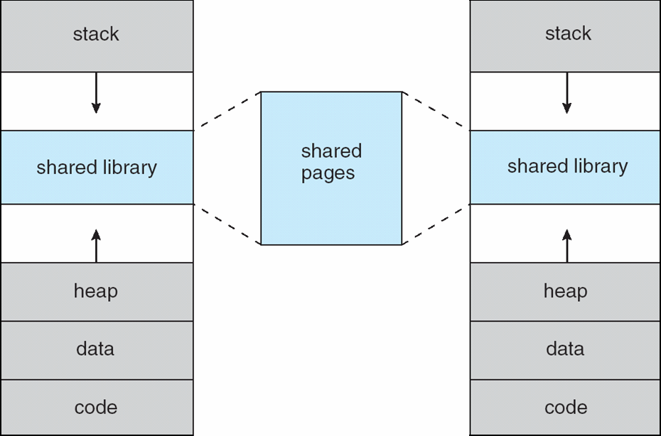

Virtual Memory
===============
### Background

Code needs to be in memory to execute, but the entire program is rarely put entirely into memory.
  * this is possible because virtual memory allows you to pretend like there is memory mapped to your desired memory locations, when in reality, the virtual memory is just swapping them in and out of disk
  * this is useful for things like error code, unusual routines, large data structures.
    * these aren't used frequently so end up just taking up space in memory. They are inefficient.
  * For the code to run, not all of it needs to be in memory at one time.

Benefits of executing partially loaded programs is possible
  * program no longer is constrained by limits of physical memory
  * programs take less memory while running.
    * allows you to run more programs at the same time
    * increase CPU utilization and throughput with no increase in response time or turnaround time
  * less IO needed to load or swap programs into memory
      * each user program runs faster  

Virtual Memory - separation of user logical memory from physical memory
  * only part of the program needs to be in memory for execution
  * logical address space can be much larger than physical address space
  * allows address spaces to be shared by several processes
  * allows for more efficient process creation
  * more programs run concurrently
  * less IO needed to load or swap proesses

Virtual Address Space - logical view of how process stored in memory
  * usually starts at address 0.
  * contiguous address until end of space
  * physical memory is organized in page frames
  * MMU must map logical to physical

Virtual Memory can be implemented via:
  * demand paging
  * demand segmentation

  * it is possible to have virtual memory that is < = > physical memory
  * virtual memory for a program uses some memory map to link to physical memory and disk.
    * program just knows its virtual memory as a list
    * the MMU does the memory mapping
    * the physical memory and disk are almost interchangeable

### Virtual Address Space

  * stack
    * grows down
    * starts at max
  * heap
    * grows up
  * doing the stack and heap thing like this maximizes address space use
  * unused address space between the stack and heap is called *hole*
    * the holes can be used for growth, dynamically linked libraries, etc.
   * the hole also means that the memory addresses used are **sparse**
  * **no physical memory is needed until heap or stack grows to require a new page**
  * system libraries can be shared by mapping them into virtual address space
  * pages can be shared during the fork() operation
    * this speeds up process creation because the same memory is used

### Shared Library Using Virtual Memory

  * the shared libraries are stored in the **holes**
  * different processes use the same shared page

### Demand Paging
Without demand paging, you bring the entire process into memory at load time

Bring a page into memory only when it is needed
  * less IO needed since you do not have to have unnecessary IO bringing unnecessary processes into memory
  * less memory is needed
  * faster response time since less memory is used
  * you can have more users running concurrently 
