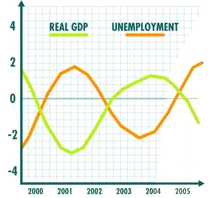
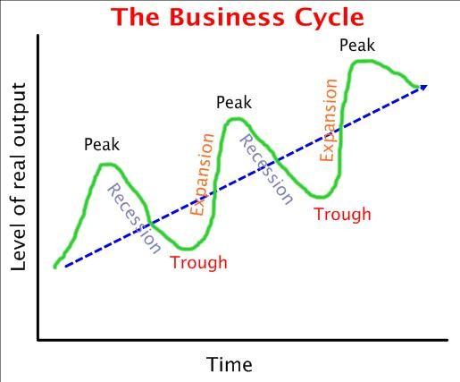

Macroeconomics
===============
### Intro
Macroeconomics is a branch of economics concerned with large-scale or general economic factors. They study the economy as a whole.

Macroeconomics has 3 goals
  * keep economy growing over time
  * limit employment
  * keep prices stable

Ways to measure how well an economy is doing include
  * gross domestic product (GDP)
  * unemployment rate
  * inflation rate

### GDP

GDP is the `value of all final goods and services produced within  a country's border in a specific period of time`, usually a year.
  * value = price
  * final = all intermediate things are ignored. ex. only new car matters, selling an old car is not included
  * specific period of time

Nominal GDP = GDP not adjusted for inflation

Real GDP = GDP adjusted for inflation

Do not think of GDP as an exact measure. It is better used as a comparative measure.

GDP is composed of
  * consumer spending
  * business spending
  * government spending 
  * net exports

### Recession and Depression
Recession = 2 successive quarters (6 months) show a decrease in real GDP

Depression = sever recession

### Unemployment
Unemployment is measured by unemployment rate.

    Unemployment rate =(number of unemployed people / number of people in labor force)  * 100

* unemployment rate only includes people in labor market. Thus only measure those who are looking for a job and can't find one. The rate of people who do not have jobs is likely much higher. Thus you do not consider
  * people who are underage
  * people who have no desire to work
  * people who have given up on working (discouraged workers)
  * people that are underemployed (someone who has a part-time job even though they are looking for a job)

There are 3 types of unemployment
  * frictional unemployment - this is just the time period that a worker goes through when transitioning jobs
  * structural unemployment - there is no need for the persons work and so the jobs they want to do simply don't exist
  * cyclical unemployment - unemployment due to a recession

Goal is not to have 0% unemployment, because people will always be transitioning jobs or their will be technology making peoples jobs unnecessary.

Goal is to have no cyclical unemployment.  

Natural rate of unemployment = lowest rate of unemployment that an economy can sustain over a long period of time
  * natural rate of unemployment = frictional employment + structural employment
  * economy is considered to be a full employment if you are at natural rate of unemployment. Things are bad if the rate is less.

### Business cycle

   * Real GDP and unemployment are inversely related. Thus as real GDP increases, unemployment decreases.

Aside: during great depression in US, unemployment peaked at 25%. Apparently, this is what Greece is at right now.

You generally want to keep prices stable. You do not want stuff to be too cheap or too expensive.

Inflation = increase in a currency supply relative to the number of people using it, resulting in rising prices of goods and services over time.
  * inflation is measure by tracking the prices of a set amount of commonly purchased items (called market basket). The inflation rate is the percent change in the price of the basket over time.
  * too much inflation is bad because it decreases purchasing power of money

Deflation = decrease in general price level of goods and services
  * bad because falling prices discourages people from spending since people will wait to buy things

Contraction = economy is going too slow

Expansion = economy is picking up

The process of booms and busts is called the **business cycle**

