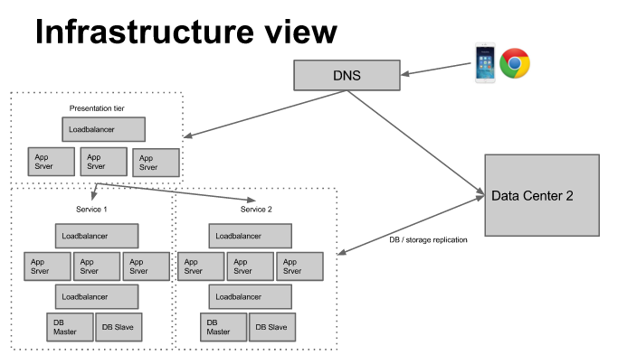
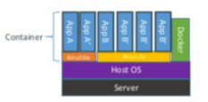
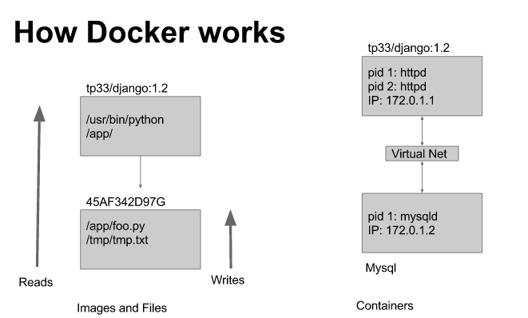

Lecture 1
============

Internet Scale apps are those that serve over 100 million users and have over 10k servers.

* > 100 million users results in  
  * you have to serve many geographies
  * you have to serve many screen types
  * small optimizations can mean lots of monetary savings
  * each small feature adds lots of complexity to the overall super complex system
* > 10k servers results in
  * complex architecture
  * complex failure modes
  * complex deployment

### Modern web architecture

Nowadays, we use service oriented architecture where a given page just makes tons of API calls to numerous services that each present a portion of information for the page.

Nowadays, we use very modular architecture where the client tier, presentation tier, business logic tier, and data tier are all split up.

When your browser makes a request, it first does a DNS lookup to determine which data center to talk to. Once at a given data center, you talk to the *presentation tier*. The presentation tier has a load balancer which tells you what app-server to connect to. The app-server then contacts a bunch of services (asynchronously in the above picture) and presents you with the information.

Each service has a similar load balancer-> app-server->load balances -> database master/slave structure.

Services can talk to other data centers if they need to.

Server configuration is super hard to do. Nowadays, it is becoming a lot easier because now they force the programmers to just specify the configs they want on the hardware and those specific configs are used.

In the above pic, you can see that most of the configuration is defined in software. Doing so makes it easy to change around the configs as per requirements.

### Containers versus Virtual Machines
Containers are isolated, but share OS, binaries, libraries.
Doing so makes containers significantly faster to deploy. There is little overhead, super easy migration, and faster restart time.

VM:

Container:

The key difference between VM and container as shown in the picture is that there is no guest OS on top of the host OS. Working with a guest OS is slow. Also, note that the guest OS has to talk to your host OS via a hypervisor which is also difficult. Docker (and other containerization technologies) connect directly to your host OS and just work with it.

Containers are awesome because
* they allow you to easily define the environment
  * Dockerfile is basically just a Makefile for system images
* they easily replicate a consistent environment
* they easily package app and dependencies

CONTAINERS RUN JOBS. The STATE of a CONTAINER is an IMAGE. The above picture is telling us that if you are trying to read/write to an image, what you actually do is go from most specific child to more general image. Each image just holds a diff of its configs compared to its parent. Thus you have to bottom bottom to top.

The right side of the picture is showing you that containers are isolated but can talk to each other via a virtual net. Note that each container has its own IP address. Also note that since each container is isolated, its process id's (PIDs) restart numbering.

 
