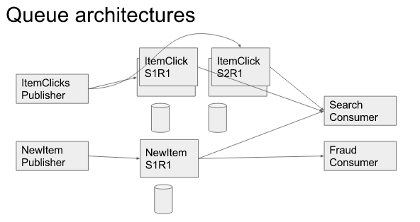

Lecture 12 - Queuing
==========

### MS research paper
Bing created a bunch of features that were meant to affect search results.

Then, they measured how much each feature had an impact on user's happiness of search results.

They ended up removing ~90% of the features they created because only a few really mattered to users.

### overview
queues are ordered (usually persistent) lists of messages

when made accessible between application they enable
  * asynchronous processing
  * decoupled systems
  * data flow oriented APIs between systems

### Asynchronous Processing
Asynchronous processing just means that the function does not block.

A few examples of things you want to make asynchronous are
  * slow operations
  * things that could fail
  * image resizing, virus scanning, format conversion
  * logging and tracking
  * search index updates
  * making calls to 3rd party APIs

You want to make all these things asynchronous so that
  * user does not have to wait for these things
  * server thread does not have to wait

##### asynchronous processing with queuing
new_listing creates a new list item asynchronously.

    def new_listing(request):
      # create item ...
      ...
      public_msg({
        "type":"new_item",
        "title":item.title,
        "id":item.id
        })

update_search just listens for all incoming requests. If one of the requests come in, then the update_search function will get it via get_msg and run the code. update_search is the queuing aspect of this.

    def update_search():
      while(True):
        i = get_msg("new_item")
        search_index(i.title, i.id)

#### Decoupled systems examples
there are numerous different systems that allow you to create a new item by the user. However, each of these must call new item trigger.

The problem that can occur is that humans have to make sure they follow each of the steps as per the 'contract' that the trigger function has.

For example, create item might require you to do a bunch of things, before you call the createitem function, but the coder might not do so.

Another issue that can occur is that the order of the tasks may matter internally but not logically to the coder. Thus the coder might call the things out of order.

### Queuing Architectures

