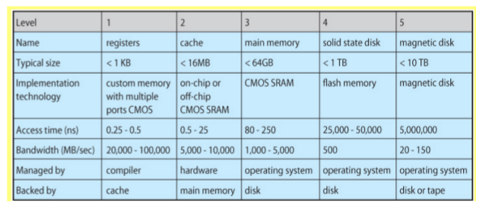

Lecture 5 - Databases part 1
=====================

### Overview
Databases store data in tables with fixed schemas.
* all tables have an PK id
* joining is combining two tables

### Types of data (for a marketplace)
Two sample models are StoreListings and Users

For all models, it is good to think of both *user submitted fields* and *annotated* fields.

User submitted fields would include things like title, picture, name, address.

Annotated fields would be things like estimated shipping time, estimated fraud score, reputation. Annotated fields are things that we as programmers calculate about a model and just want to store in the database.

### CAP theorem

Consistency = All users accessing the database must see the same information. You get consistency by updating remote copies of a given piece of data before allowing other updates to proceed.

Availability = You must always be able to read/write/update data in the database. You can increase availability by duplicating the data.

Performance = Read performance and write performance should be super fast. Performance is attained by not waiting to update remote copies of a given piece of data.

CAP theorem says that you cannot have all three of Consistency, Availability, and Performance.

In the real world, it ends up being best a lot of times to just be available and fast. Thus consistency is the one people sacrifice. This works for a lot of things because not all information is super critical.

consistency/availability are in direct opposition with performance

### Security Requirements
It is good to have different levels of security for different types of data because extra security makes things slower.

### Data management Requirements
You want to be able to
* backup and restore the data generally without site downtime.
* maintain the data without site downtime
  * maintain means to be able to add new software version, update the hardware, etc.
* monitor and alert capacity or other problems
* scale up or down without site downtime

### Scale
Sites serve billions of page view per day. Each page view ends up requiring multiple reads.

### Technology limitations

### Physical limitations
Speed of light is a limitation because it governs how fast information can move between locations.

Note that you

### Database transactions
Transactions are a group of reads/writes to the database
* make sure either they all happen or none happen
* make sure concurrent users never see an "in between state"
  * never see half the updates done
* these grouped updates are called transactions

### Scaling issues with transactions
There are two main components for how transactions are implemented: *logging* and *locks*.

Logging is a way to make sure the updates in a transaction all happen or not. The specific type of problem that logging helps to solve is:
* want to update two tables - table 1 and table 2
* update table 1 and then db hits a bug and crashes
* on restart, database is "inconsistent" as it shows the update to table 1 but not to table 2. This should NOT be allowed based on the rules of transactions.
