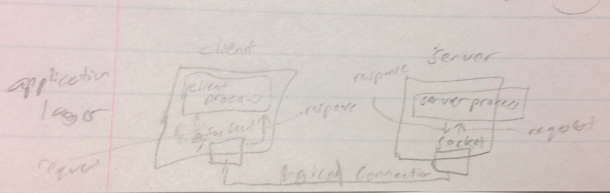
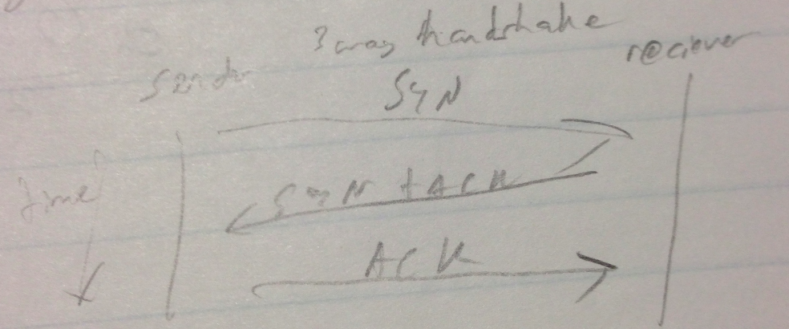
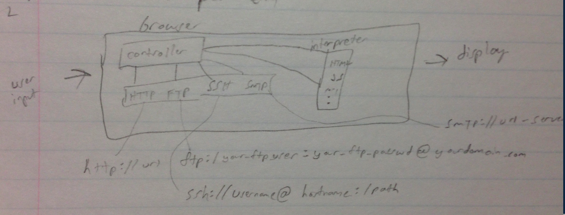

Application Layer
==================

| *Packet Names*  | *Layer*  | *Addresses*  |
|---|---|---|
| message  | application layer  | names (url) (eg. example.com, a@gmail.com)  |
| segment(TCP) / user datagram(UDP)  | transport layer  | port number (eg. default port 60 for HTTP, 443 for HTTPS)  |
| datagram  | network layer  | logical names (eg. IP address)  |
|  frames | data link layer  |  link layer address (eg. MAC # for hosts and routers) |
| bits  | physical layer  | ---  |

### Multiplexing / Demultiplexing
Multiplexing is when multiple higher layer protocols use a lower level protocol to send data. They do so because numerous higher level protocols are built from lower level protocols - they follow the lower level protocol but also add on to it.

A common protocol hierarchy is:
FTP and HTTP are built on top of TCP.  
DNS and SNP are built on top of UDP.
TCp and UDP are built on top of IP.

For example, you have two different devices where one uses FTP to communicate and the other uses HTTP. The two devices can still communicate with each other because the FTP and HTTP are both built from TCP. A MUX can be used to turn your HTTP and FTP communication into the common TCP protocol. Then, once the communication has reached its end destination, a DEMUX can be used to convert it back to its original FTP or HTTP communication.

If you go down the hierarchy, it is called multiplexing.  
If you go up the hierarchy, it is called demultiplexing.

### ISO/OSI (international standards organization / open systems interconnection)
Note that ISO is just an organization that created this OSI protocol. Also note that the OSI protocol is not really ever used - it is more just for modeling/instruction purposes nowadays because it clearly shows all the different things that need to occur for proper communication.

The goal of OSI was to defeat TCP/IP upon inception. It failed.  
The layers that OSI has are:
1. Application
2. Presentation
3. Session
4. Transport
5. Network
6. Data Link
7. Physical

Note that OSI is very similar to TCP. The Application, Presentation, and Session layers of OSI are all done in the application layer of TCP.

The Presentation layer of OSI is responsible for data conversion. For example, it will convert between Ascii and EBCDIC (for IBM), big endian and little endian, encryption/decryption, and perform data compression/expansion.

The Session layer establishes controls and ends connection sessions.

*Ascii/EBCDIC aside*  
To convert from ascii to EBCDIC, you normally convert to ascii to universal encoding which then is converted to EBCDIC.

### Paradigms

There are two main types of paradigms in networking in the application layer - *client-server paradigm* and *peer to peer (P2P)*.

### API (Application Programming Interface)
API's are a way to connect between various systems. These are the key ways to send data across systems. There are 3 key API types - *Socket Interface*, *Transport Layer Interface*, and *Streams*. Note that these are all in fact just API's, meaning that they all just list a bunch of functions that are supposed to be used in a specific way to attain proper communication.

##### Socket Interface
The socket interface is the most common. You can use either UDP or TCP to work with socket interface.

##### Transport Layer Interface (TLI)
Not nearly as popular as the socket interface. It was used for SV3 and SV4 OS's. A derivative of SV4 is solaris. TLI is not used in windows or most unix/linux environments. Point is, TLI is not used in modern day systems.

A key thing to note about TLI is that it uses the OSI.

##### Streams
Streams are designed for System V. They are for multiprocessor systems.

Streams were originally created to perform communication between applications and the kernel but were extended to cover networking.

### Sockets in Detail

On Windows, we use winsock while on Linux/Unix we use Posix socket interface. The functions they implemented are identical.

*Quick aside on POSIX*  
POSIX (portable operating system interface) is just a bunch of IEEE standards for APIs, command line shells, and utility interfaces for working between different OS's.

The socket interface implements the following functions (note that I added on to his notes using the Berkley sockets interface):
* Socket() - creates a endpoint (socket) for communication. This returns a file descriptor for the socket.
* bind() - assigns a socket to an address. The socket is given an IP address and port number to potentially use.
* listen() - prepares for incoming connection. It basically just listens for communication.
* accept() - if communication came in, then a socket needs to establish a proper connection with it in order to properly send/recieve data. I assume this function represents the handshake between the two sockets.
* send/recieve - send/recive data

Sockets may seem somewhat confusing, but they are no different than writing to a file. Your application reads/writes to a file in the same way it read/writes to a socket. Thus *a socket is just a data structure*.

This image shows the communication between the client and server via sockets. The client and server have a logical connection via a socket.
Information Flow:
1. logical connection is established between client and server
2. client simply writes requests onto the socket
3. request is sent across the socket to server's socket
4. server reads request
5. server writes response to socket
6. response is sent across socket
7. response is read by client

The big question now is, what is inside a socket?
* 16 bit port number (thus can handle 2^16 different port numbers)
* 32 bit IP address (thus can handle 2^32 different IP addresses) (note that IPv6 is 128 bit so can handle lots more)

### Working with IP addresses
TODO

### Transport Layer Protocols
1. UDP - connectionless, not reliable, doesn't handle error or congestion, message based.
2. TCP - reliable, single homing (can connect to only a single ISP), stream-based (contiguous bytes sent in a given session)
3. SCTP

### SCTP (Stream Control Transmission Protocol) in detail
The cool thing about SCTP is that it supports multi-homing which means that it can connect to multiple ISP's. This allows for redundancy so that if your ISP goes down, you have a back up. Clearly, this is for more critical systems.

In order to support multi-homing, SCTP uses Border Gateway Protocol (BGP) can be used to configure IP address to be used by multiple ISPs.

SCTP also supports multi-streaming. Multi-streaming is when you have multiple streams of data coming in. The order that the individual bits of a given stream or the order of the streams themselves is not important. This is useful for multimedia applications.

### 3 way handshake

The sender sends a SYN packet. The reciever than replies with the same SYN packt but with a ACK packet appended onto it. The sender then completes the handshake by sending an ACK packet.

### HTTP (Hyper-text transport protocol)
HTTP is used to send data as web pages across Internet. It is a pure client-server paradigm.

The key ideas from the picture are:
* the user inputs data into the browser which the browser than manipulates and uses to display information to the user
* a browser has a controller that controls the various types of communication that the browser can use and the various languages it will interpret
* FTP format is: ftp:/your_ftp_server:your_ftp_passwd@yourdomain.com
* ssh format is: ssh://username@hostname:/path
* SMTP format is: smtp://url-server
