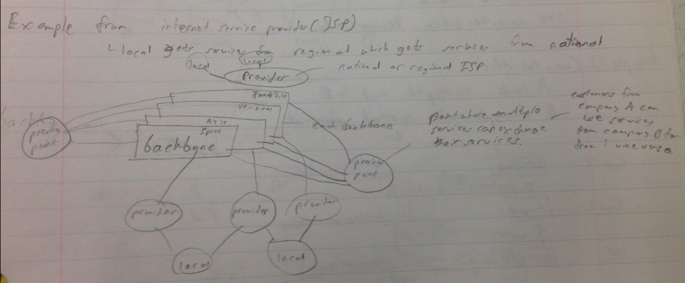
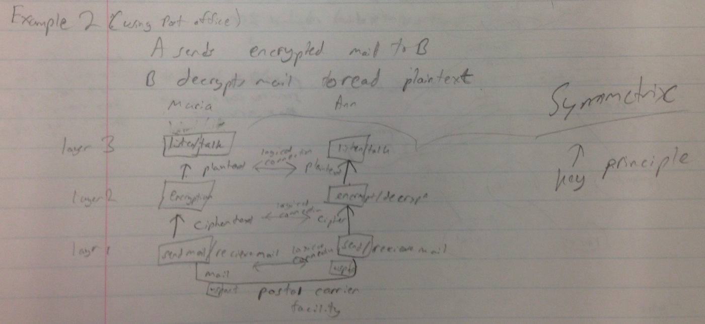
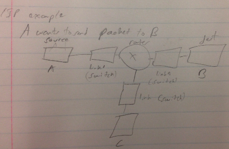
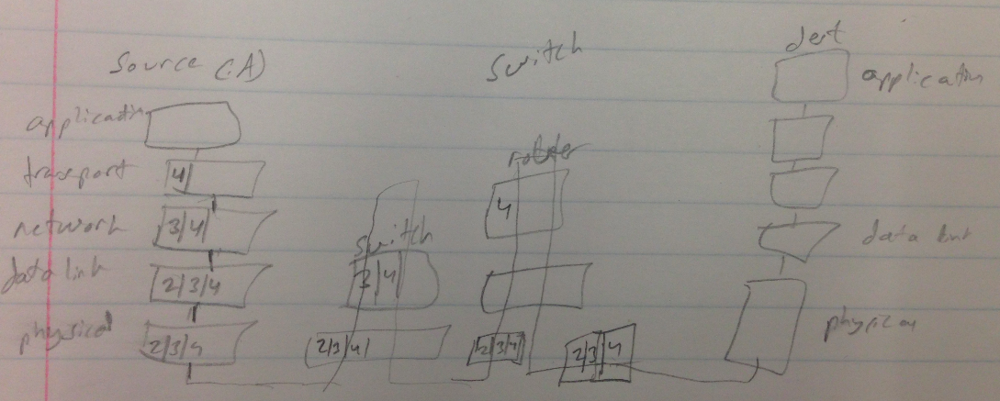

Class 2
=========

## There are two types of switches
Circuit Switching (multiprocessor)
Packet Switching (uniprocessor)

## Example Network System

In this network, the multiple ISP's each make up a backbone of the internet. Each one of those global providers are fed by local providers. The *peering point* is where different ISP comes to exchange services. What they end up doing is making it so that customers from ISP A can use the services of a different ISP B for free in exchange for the ISP B customers getting ISP A's services for free.

## Accessing the Internet
1. Use telephone networks
2. User cable networks
3. wireless
4. direct connection to the internet

## Protocol/layers
A *protocol* is a set of rules that both the sender and receiver have to follow.  
The benefits of layers are
* simple design because of smaller portions
* modular
* other layers can still function properly even if one layer breaks

Key ideas for human communication
* greet a person when you meet them
* confine vocabulary between the two of you based on what your appropriate relationship is
* refrain from talking when the other is talking
* each knows conversation is a dialog
* say bye when finished talking

2 Key Principles for Protocol design
* opposite function occur at each layer
  * the logical connections show that if one side is encrypting, then the other side is decrypting
* symmetric
  * the layers to the left are in the same order as the layers to the right

The above photos show a real TCP/IP example.  
Firstly, note that the top photo is showing the basic network structure that is being used in this system - A wants to send a packet to B and along the way is a switch that connects to a router. That router is then connected to another switch which finally connects to the destination B.  
The bottom picture shows what is inside the packet at various stages of the transport.
1. At the *Application Layer*, the payload is determined and put in the packet. This is not shown in the picture.
2. At the *Transport Layer*, a header is added
4. At the *Network Layer*, a header is added
5. At the *Data Link Layer*, a header is added
6. At the *Physical Layer*, a header is added
7. Then you go to the switch. Switches work with 2nd layer (Data Link Layer) thus they ONLY look at that header. The switch determines that the packet should go to the router
8. The router works with the 3rd layer (Network Layer) thus ONLY looks at that header. The router determines that the packet needs to be sent to the second link. (second link not shown)
9. The second link (not shown) then sends the packet to the destination.
10. The packet goes up the destination side. At each step of going up the destination, the packets headers are looked at to verify any issues.

Key things to note:
* switch determines where to send packet use the mac number of the destination. Each end system has a mac number.
  * in the case of switch 1, the switch determines that there is no end system with the appropriate mac number so just sends it to the router. There are most certainly specific algorithms involved here which we will go over later.
* switches use only layer 2  - Data Link Layer
* routers use only layer 3  -  Network Layer

Tasks performed by Transmission Control Protocol (TCP):
* flow control
* error control
* congestion control

User Datagram Protocol (UDP) is a much simpler protocol than TCP because UDP
* doesn't check for errors
* doesn't check for congestion
* there is no persistent connection between sender and receiver (very little flow control)
Still, UDP can be used to broadcasting/streaming video

3 other important protocols are:
1. Internet Control Message Protocol (ICMP)
2. Dynamic Host Config Protocol (DHCP)
3. Address Resolution Protocol(ARP)
