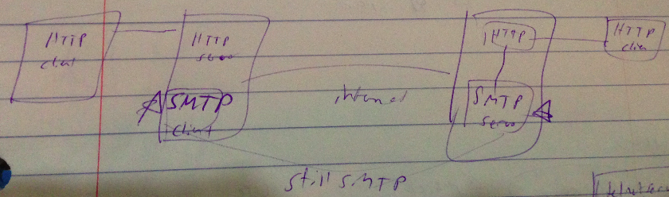
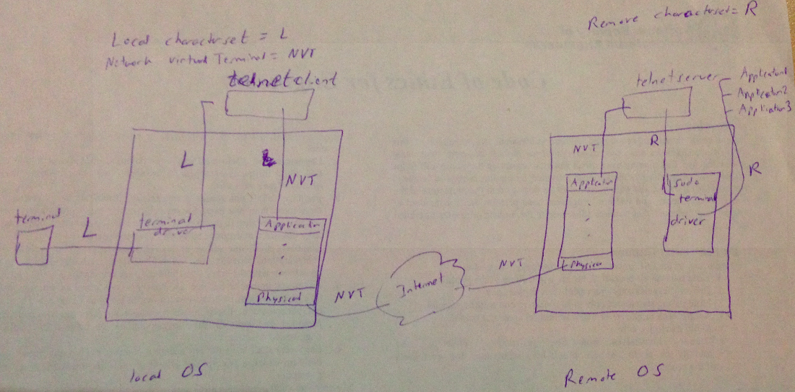

Lecture 6
==========

### MIME (multi purpose mail extensions)
used for sending images, videos, and non-text files for **emails**

Has its own headers:
* MIME-version
  * current version is 1.1
* Content-Type
  * type/subtype
* Content-transfer-encoding
* Content-id
* Content-description
  * explanation of all information given

##### type/subtype of MIME
Type and subtypes of type are:  
* text
  * subtypes are plain, html
  * this is displayed as: "Content-Type: text/plain"
* multipart
  * email contains multiple parts
  * subtypes are *mixed*, digest, alternative and parallel
    * mixed is when you have text followed by image followed by audio...
    * mixed and digest are the two minimal requirements for some application that supports MIME. If some MIME type comes in that is not one of these two, then it is treated as mixed.
    * when you give multipart header, you must also define a *synchronization boundary* string that is used to separate out the different parts of the message
    * usage: "Content-Type: multipart/mixed; boundary=frontier"
    * parallel means that there is no order to the parts.
* image
  * gif, jpeg
* video
  * mp4
* audio
  * basic, mp3

*MIME multipart detail*  
MIME multipart messages contain a boundary. This boundary must not occur in any of the parts, is placed between the parts, and at the beginning and end of the body of the message.

In this example, the boundary is frontier. Note that
* frontier is not a string in any part of the message
* frontier is preceded by --
* frontier is put at the start of the body
* frontier is put at the start of each part (which by default means start of body as well)
* the final frontier ends with a --. Thus you have --frontier--

Example:

    MIME-Version: 1.0
    Content-Type: multipart/mixed; boundary=frontier

    --frontier
    Content-Type: text/plain

    This is the body of the message.
    --frontier
    Content-Type: application/octet-stream
    Content-Transfer-Encoding: base64

    PGh0bWw+CiAgPGhlYWQ+CiAgPC9oZWFkPgogIDxib2R5PgogICAgPHA+VGhpcyBpcyB0aGUg
    Ym9keSBvZiB0aGUgbWVzc2FnZS48L3A+CiAgPC9ib2R5Pgo8L2h0bWw+Cg==
    --frontier--

*MIME multipart difference between parallel and mixed subtypes*  
Multipart/mixed means the multiple parts in the email are completely independent of one another; however, their order matters. Clients normally display the parts one after another.

Multipart/parallel means the multiple parts in the email are completely independent of one another; however, their order does NOT matter. Clients normally display the parts simultaneously. For example, the client can read the email, view the picture, and hear the sound, all at the same time.  

##### Content Transfer Encoding

* 7-bit NVT(network virtual terminal) ASCII code
  * when communicating between different machines which use different text representation techniques, you need a universal format to convert to. This universal format is NVT.
  * 7-bit ASCII is considered to be used as NVT by the RFC docs
* 8-bit ascii extension
* binary
* base64 - primarily used for images, video. groups 6 bits at a time and turns it into an ascii character
* quoted printable

The motivation behind these all is that they are human readable.

##### base64
6 bits grouped together.  
2^6 = 64 different values possible
smallest number is 000000
largest number is  111111

The 64 different values are:

|symbols|base64 number|
|---|---|
|26 upper case letters|0-25|
|26 lower case letters|26-51|
|10 digist|52-62|
|+|63|
|/|64|

When you combine the 6 bits together, you simply replace the decimal value of those 6 bits with the appropriate replacement from the above 64 different values.

Say you have: 11001100 01110001 00111001
You have to group the 3 8-byte values into 4 6-byte values
* 110011
  * this is 51 in decimal
  * 51 is z in the above chart.
* 000111
  * this is 7 in decimal
  * 7 is I in above chart
* 000100
  * 4 in decimal
  * 4 is D in chart
* 111001
  * 57 in decimal
  * 57 5

Thus the 3-byte sequence 11001100 01110001 00111001 is converted into the 4-byte sequence zID5

Base64 requires you to use 4 bytes to represent 3 bytes.

    redundancy:
    extra bytes / base64 bytes = % extra *bits* required to represent same thing

Thus, base64 has *25% redundancy*

You want to use base64 for large media types

##### quoted-printable
* decimal value range from 23-126 in ascii for printable items. If numbers are in between 23-126, then don't do any conversion.
* if not in 23-126 range, replace with =byte1byte2. Thus each byte is replaced with 3 bytes(1 byte for =, 2 more bytes for conversion)
  * the = is called an escape character

To convert =, you have to escape the = with =.
* = is 61 decimal ascii. In hex, this is 0x3D.  
* Thus the conversion is going be use =3D

Note that quoted-printable has

    num extra bytes / quoted-printable byes = % redundancy
    2 / 1 = 200% redundancy

examples:   
* 00100110
    * in decimal this is 38.
    * 38 decimal is ascii &
* 01001100
    * 76 decimal is ascii L
* 10011101
  * 157 decimal -> 0x9D hex
    * note that 0x9D is 10011101
  * 1001 is decimal 9
  * 1101 is decimal D
  * you convert the 9 into ascii 9
    * ascii 9 is symbol 57 in the ascii table
    * ascii 9 is 8 bits
  * you convert the D into ascii D
    * ascii D is symbol 68 in the ascii table
    * ascii D is 8 bits
  * thus the resulting ascii will be =9D
* 00111001
  * 57 decimal is ascii 9
* 01001011
  * 75 decimal is ascii K

### Example email

    receiver: Frank@somecompany.com
    subject: hi there
    MIME-Version:1.1
    Content-Type: multipart/mixed; boundary=snip,snip,snip

    --snip,snip,snip
    Content-Type: text/enriched
    Character-Set: us/ascii

    sample message
    --snip,snip,snip
    Content-Type: audio/basic
    Content-Transfer-Encoding: base64
    Content-Discription: happy bday

    audio_converted_to_base64
    --snip,snip,snip
    Content-Type: image/gif
    Content-Transfer-Encoding: base64
    Content-Discription: cutting cake

    image_converted_to_base64
    --snip,snip,snip--

Notable parts:
* boundary at start of body
* there are specific part headers after a boundary to indicate what type of content that portion of the body is
* 3 different parts
* after last boundary, there is a --
* audio, image content is transfer using base64 encoding

### Web-based mail

SMTP for outgoing mail; POP3/

If you want to instead use HTTP (one side), then you have to
* change the SMTP client on the MTA (message transfer agent) on that side to be a HTTP
* change the MUA (mail user agent) on that side to be HTTP

If you want to instead use HTTP on both sides, then you have to
* change the SMTP client on the MTA (message transfer agent) on that both sides to be HTTP
* change the MUA (mail user agent) on both sides to be HTTP

**You can replace as much as you want with HTTP, but the inter-MTA communication will always be SMTP**

### Telnet (terminal network)
Key use of telnet is remote login.

Remote login requires authentication by entering login id and password. This can be difficult across networks because different computers use different encoding systems. Therefore, NVT (network virtual terminal) was created to act as a universal encoding. The idea is to convert local text into NVT text. Then, the receiver can convert from NVT to its own local text.

Note that Telnet is old and insecure, so it has been replaced by shh.

##### NVT (network virtual terminal)
NVT seems to be SPECIFIC for Telnet

NVT (network virtual terminal) was created to act as a universal encoding. The idea is to convert local text into NVT text. Then, the receiver can convert from NVT to its own local text.

* you work in your local character on your local machine
* the telnet client converts outgoing traffic into NVT
* data formatted in NVT is what is actually is sent across the system as shown by the application to physical layer stack
* the remote OS will see the NVT format at first
* the remote OS will have a telnet server which will convert the NVT text into the character set that the remote OS supports

The official NVT is whatever is suggested by RFC.

Commands that telnet sends
* open - open a connection
* close - close a connection
* mode - change modes
  * line mode - wait to send until whole line is read
  * character mode - send as soon as a character is input
* send - send data
* quit - quit telnet client. closes entire telnet session

### SSH (secure shell)
replaced telnet

2 versions - ssh 1 and ssh 2

forget about ssh 1. the two are not compatible

ssh-2 layers:  
* application
* ssh-conn
  * check to make sure you are talking to correct server
* ssh-auth
  * authorize user
* ssh-tran
  * secure transmission
* tcp (includes transport, network, data link, and physical layers)

SSH-Tran provides
* privacy and confidentiality
* data integrity
  * even if attacker sees data, attacker cannot change data
* server authentication
* compression

SSH-auth provides
* verifies users password/login id

SSH-conn provides
* makes connection between client and server

Note that the order these things occur is: ssh-tran -> ssh-auth -> ssh-conn

2 key things you can do once you ssh
* remote login
* data transfer

##### SSH Tunneling (port forwarding)
SSH tunneling creates secure tunnel between server and client.

##### Using SSH to make secure connections for other protocols
FTP can be run on top of ssh which allows FTP to indirectly talk to another FTP server via a secure shell tunnel.

The way this would work is that your FTP client would give data to your local SSH connection. This local SSH connection would link to the remote SSH connection via the secure tunnel. The remote SSH connection would send that data to the remote FTP client.

In this scenario, there is *no actual communication* between the two FTP clients. The entire connection is done entirely by SSH. There is however a logical connection between the FTP clients.  

Doing this would make your FTP communication a lot more secure.
