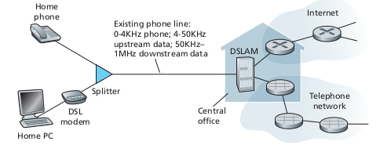

Computer Networks and the Internet
==============

## What is the Internet ?

### Nuts and Bolts
The Internet is the computer network that interconnects millions of computing devices throughout the world.
#### Internet versus internet (upper versus lower 'i')
  * Internet (uppercase) is whole world
  * internet (lowercase) is smaller. Just any bunch of devices that can contact each other.

#### Vocab
* host or end systems
  * each device that a computer network connects to
  * hosts are connected by communication links and packet switches
* communication links
  * a way to connect 2 hosts.
  * made from coaxial cable, copper wire, optical fiber, radio spectrum
* transmission rate
  * transmission rate of a communication link determines the rate at which the link can transmit data from a host to another
  * measure in bits/second
* packets
  * when links send data, they send it in chunks called packets.
  * the data to be transferred is segmented and then each segment is given a header. The packet includes simply a segment and its header.
* packet switch
  * takes a packet arriving on one of its incoming communication links and forwards that packet on one of its outgoing communication links.
  * 2 common types of packet switches are routers and link-layer switches
* link-layer switches
  * typically used in access networks
* routers
  * typically used in network core
* route or path
  * the sequence of communication links and packet switches a packet takes to go from its starting point to destination
* Internet Service Providers (ISP's)
  * hosts access the Internet through ISP's
  * there is a hierarchy of them include:
    * residential (local cable or telephone companies)
    * corporate
    * universities
    * ISP's that provide WiFi in airports, hotels, coffee shops,...
  * Each ISP is a network of packet switches and communication links
  * ISP's provide internet access to both content providers and content consumers
* protocols
  * end systems, packet switches, and other pieces of the internet all run protocols that control the sending and receiving of information within the Internet
  * two common examples are Transmission Control Protocol (TCP) and Internet Protocol (IP). These are so famous and so important that the Internet's principle protocol is considered to be TCP/IP
* Internet Protocol (IP)
  * specifies format of packets that are sent and received among routers and end systems
* Internet standards
  * Because of the importance of protocols, there needs to be standards to how they should be implemented and what exactly they should do.
* Requests for Comments (RFC's)
  * The Internet Engineering Task Force (IETF) creates the standards that everyone on the internet agrees to. The standards are called RFC's

#### Internet = an infrastructure that provides services to applications
The internet can be thought of as an infrastructure that provides services to applications. The applications include things like email, web surfing, social networks, ...

The applications involve multiple different end systems that exchange data with each other. Because of this, they are called *distributed applications.*

End Systems each provide an *Application Programming Interface (API)* that specifies how a program running on one end system asks the Internet infrastructure to deliver data to a specific destination program running on a different end system.

#### Network Edge
Each end system is also called a 'host' because run *application programs* such as web browsers.

There are two types of hosts: *clients* and *servers*. Clients tend to be desktop and mobile devices while servers are more powerful machines that store and distribute web content from large *data centers*.

#### Access Networks

The two most prevalent types of broadband residential access are *digital subscriber line (DSL)* and *cable*.

##### DSL
DSL internet access is usually attained from the local telephone company. Thus DSL modems use the existing telephone lines to exchange data with digital subscriber line access multiplexers (DSLAM).

When you have DSL, you are actually using a phone line to connect to the internet. On the customer side, you have a splitter that only receives telephone data and splits that up between phone and internet data (going from central office to home). It also takes in home phone and home internet data sends it via the phone line (going from home to central office). On the telephone company side, DSLAM converts between telephone and internet messages.

The DSL transmission rates for upstream and downstream are different. Thus the access is *asymmetric*.

##### Cable Internet Access
cable television companies use their existing cable tv infrastructure.

When you have Internet access via cable, your home is connected with a coaxial cable to a fiber node. Each fiber node is then connected to the cable companies cable model termination system (CMTS) via fiber cables. CMTS is then connected to the Internet.

CMTS converts the analog signals sent from the cable models in the homes into digital format.

##### Key Differences between DSL and cable
* Both DSL and cable convert the home analog data into digital data for use in the Internet. DSL uses DSLAM to do this. Cable uses CMTS to do this.  
* DSL range is about 5 miles from the central office. cable range is about 500 to 5,000 homes per junction. Thus cable can hold a lot more and is more varied.

##### fiber to the home (FTTH)
This is an emerging technique where fiber cables are connected directly from the central office to the home. This is supposed to be super fast. This is what Verizon FIOS is.

There are two optical-distribution network architectures that perform this splitting - active optical networks (AONs) and passive optical networks (PONs). AONs are basically switched ethernet. PONs are a bit different.

Note, PONs with FTTH is how Verizon FIOS works. Each home has a optical network terminator (ONT) which connects to a neighborhood splitter using fiber cable. Then, the splitter combines optical signals from all the homes into a single, shared optical fiber which then connects to the OLT at Verizons central office. The OLT then converts the optical signals into electrical signals in order to work with the central offices router and connect to the internet.

#### Local Area Network (LAN)
Used to connect smaller regions such as university campuses and homes.

Ethernet is the most prevalent access technology in LAN. Ethernet uses twisted-pair copper wire to connect to an Ethernet switch. The Ethernet switch is then connected to the larger Internet.

At each step of the way, bits are transferred via physical medium such as coaxial cable, twisted-pair copper wire, multimode fiber-optic cable, terrestrial radio spectrum, and satellite radio spectrum. These physical media are either guided or unguided. Guided media sends waves across a solid medium such as fiber-optic cable, a twisted-pair copper wire, or coaxial cable. Unguided media sends waves that propogate in the atomsphere and in outer space. wireless LAN or digital satellite are unguided.

In terms of costs, the materials for this are much cheaper than labor costs. Thus it is best to install cable in each room in a house instead of doing it on demand.

#### Physical media

##### Twisted-Pair Copper Wire
* least expensive
* most commonly guided transmission medium
* >99% of wired connections from telephone handset to local telephone switch use twisted-pair copper
* consists of 2 insulated copper wires (each is 1mm thick) arranged in a regular spiral pattern. The wires are twisted together in order to reduce interference.
* multiple wire pairs are bundled together in a cable by wrapping the pairs in a protective shield.
* Unshielded twisted pair (UTP) is used in computer networks within a building

##### Coaxial Cable
* 2 copper conductors that are concentric (circles that share same center)
* special insulation and shielding
* faster than twisted pair
* guided
* can be used as a *shared medium* - multiple end systems can be connected directly to the cable

##### Fiber Optics
* thin, flexible medium that conducts pulses of light. Each pule represents a bit
* fastest

##### Terrestrial Radio Channels
* radio channels carry signals in the electromagnetic spectrum
* can penetrate walls
* can go long distances

##### Satellite Radio Channels
* *geostationary satellites* - remain permanently above the same spot above the earth.
* *low-earth orbiting (LEO) satellites* - closer to the earth. rotate around the earth. communicate with each other along with the earth.
