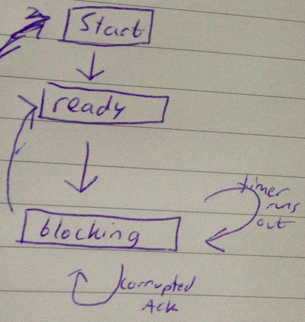

Lecture 10
==============

### Stop and Wait
features:
* window size = 1
* supports checksum
* supports sequence number
  * **only need 2 numbers, thus switch between 0 and 1 sequence numbers**
  * sequence numbers are used to detect duplicates
* has timer

##### Sender
Sender window only has one socket. Receiver window only has 1 socket.

Sender Steps:

1. sender sends packet.
2. Starts timer.
3. Waits until ACK comes back.
4. if timeout, then sends packet again
5. when ACK comes back, slides window forward

##### Receiver

Receiver Steps:

1. has window of packets it wants to receive
2. receives a packet
3. validates packet
4. determines sequence number for ACK packet
5. sends ACK with correct sequence number

##### handling corrupted packets
Both sender and receiver Handle corrupted packets by dropping them. Do not send ACK.

##### Sequence Numbers
Determines range of sequence numbers by:
* if packet arrives safe and sound -> receiver sends ACK message.
  * Packet number is x.
  * ACK number is x+1.
* packet is lost or is corrupted at receiver side
  * receiver thus never received proper x
  * once timer runs out, sender sends x back again.
  * once receiver gets correct packet, it sends back x+1  
* packet arrives at receiver, but ACK is corrupted or lost on the way back
  * sender just drops corrupted packet.
  * timer will go off
  * sender will resend the original packet with value x (duplicate)
  * receiver will send back ACK x+1

Note that there is only 0 and 1 in this sequence. Thus, x+1 means 0 if x=1.

##### States

For the sender, the states are

* start -> ready
  * this occurs when request comes from application
* ready -> blocking
  * request packet with sequence number s. s is a pointer to the only slide in the window that is suitable for use with stop and wait
  * save a copy of the packet. save so that if the packet is lost, you can resend it
  * start timer
* blocking -> blocking (timer runs out)
  * resend the packet and restart the timer
* blocking -> blocking (corrupted ACK packet comes in)
  * discard it
* blocking -> ready
  * this occurs if ACK with sequence number s+1 arrives.
  * slide the sent window forward by 1

For the receiver, there seems to be only the ready state. While in the ready state, different things can occur.
* packet comes in which has sequence number equal to r_old
  * deliver current packet to application
  * slide receiver window forward by 1. thus r_new = r_old+1
  * send ACK with ACK number r_new
* packet comes in with sequence number != r_old
  * discard the packet
  * send ACK r_old back to sender

There is an example using stop and wait. It has the same concepts as selective repeat protocol in lecture 12, but with window size =1  
TODO: use example from his notes for stop and wait

Once the network is thick(high bandwidth) and long (long runtime delay)
* bandwidth is a product. represent volume of pipe. 20 sec to 
*
