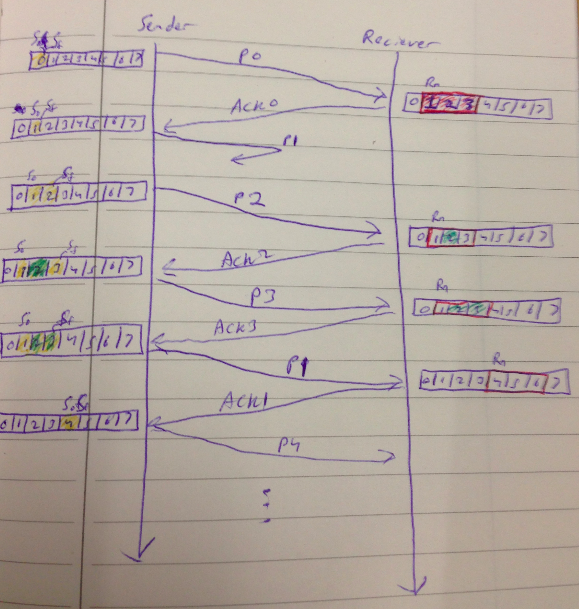
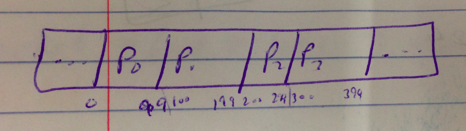

Lecture 12
===============

### Selective Repeat Protocol

m = number of bits used

max window size = 2^(m-1)

buffer size = 2^(m)

The buffer size and max window size is the same for the sender and receiver.

Sender side has variables Sf and Sn
* Sf = start of window
* Sn = end of window

Receiver side has variables Rn
* Rn = the packet expected to be recieved. This will be the start of the window.
* The end of the receiver window is Rn + (max window size - 1)

**Packets can be sent and acknowledged out of order**

**Packets can be received out of order**

**There is a unique timer for each packet sent. It is started as soon as the packet is sent. The first timer to start will be the first to go off.**. Once the timeout occurs, you start sending from the **leftmost side** again. You only send packets that have **not already been acknowledged**

#### Why do we have a max window size?
Note that if **m=2**, then **max window size = 2 ^(m-1) = 2** and **buffer size = 2^m = 4**

To illustrate that the window size cannot be greater, we will make max window size = 3 in this **INVALID** example.

Key:
* The yellow means that that packet has been sent
* red outline reveals the window for the receiver
* green means that received packet that is in middle of window
* Sf and Sn specific window for sender
* Rn specifies window for receiver
* The initial window is only at 0 for sender
* The initial window is from 0-2 at receiver

Understand Flow of Image:

1. the sender sends packet 0
2. packet 0 is marked as being sent
3. once packet 0 arrives, window is slid over by 1
4. receiver sends acknowledgement for packet 0, but it fails to reach sender
5. repeat steps 1-4 for packet 1
6. repeat steps 1-4 for packet 2
7. Since the window size is only 3, we cannot send the next packet. So, we send the leftmost packet in our window - packet 0. (We are at 4th image at sender side)
8. *On the receiver end, packet 0 has technically already been received. But, we have no way of distinguishing it from the 0 in our current window*. **This is because our window size is too big**. This would not occur if the window size were smaller. It is marked green because the packet is in the middle of the window.

Thus, we should have a **max window size = 2 ^ (m-1)**

#### Properly working example of Selective Repeat Protocol
m=3  
max window size = 2^(m-1) = 4  
buffer size = 2^m = 8  

Key:
* The yellow means that that packet has been sent
* red outline/shading reveals the window for the receiver
* green means that received packet that is in middle of window
* Sf and Sn specific window for sender
* Rn specifies window for receiver
* The initial window is only at 0 for sender
* The initial window is from 0-2 at receiver

Flow:

1. packet 0 is sent and marked as sent
2. packet 0 is received thus receiver window is slid by 1
3. acknowledgement for packet 0 is sent
4. acknowledgement for packet 0 is received and thus sender slides window by 1
5. packet 1 is sent and marked as sent
6. packet 1 is lost
7. since packet 1 never came to the receiver, the receiver does nothing related to it
8. packet 2 is sent and is marked as sent.
9. receiver realizes that packet 2 came out of order. It marks packet 2 has having been received and sends an acknowledgement for packet 2.
10. sender receives acknowledgement for packet 2 and marks it as acknowledged. It realizes that packet 2 was acknowledged out of order.
11. sender sends packet 3 and marks it as being sent.  
12. receiver marks 3 as received and sends an acknowledgement for packet 3.
13. the window is done. The sender was not able to move the window since the start of the window has not been acknowledged. So, the sender starts the timer.
14. the timer runs out.
15. the sender restarts sending from the leftmost side of the window. It sends only packets that have not been acknowledged.
16. Thus, the sender sends packet 1.
17. the receiver receives packet 1, marks it as having been received, and sends an acknowledgement for packet 1
18. the sender gets packet 1's acknowledgement and moves the window all the way up to 4. It does so because packets 2 and 3 have already been acknowledged as being sent correctly.
19. The sender would at this point send the next available packet - packet 4.
20. the receiver also moves its window all the way up to packet 4 because packets 2 and 3 have already been acknowledged as being received.
21. the process continues...

Thus packet 1 was sent and acknowledged out of order.

##### Bidirectional
You can make selective repeat protocol bidirectional by simply making sender the receiver and vice versa. This is called **piggybacking**.

### we learned 3 protocols
* Stop and Wait - handles only 1 packet at a time
* Go back to N
* Selective Repeat (SR) - handles multiple packets at a time

### UDP
Features of UDP
* connectionless, not reliable
* does not establish connection
* does not support proper error control(checksum doesn't count), flow control, or congestion control
* does have checksum, but this is not proper error control

**All packets are independent for UDP. You do not use any of the protocols for UDP**.

UDP does support checksum. You can enable or disable it. Default is disable.

#### UDP header format
uses 8 bytes

* Each box is 2 bytes
* total length includes header size + payload size

##### sample udp header
CB84 000D 001C 001C
* 0xCB84 -> 52100 -> source port number is 52100. This is some private dynamic port
* 0x000D -> 13 -> destination port number is 13. This is the well defined datetime process
* 0x001C -> 28 -> total length = 28
  * Header is 8 bytes. Total length is 28 bytes. Thus payload = 28-8 = 20 bytes
* 001C -> 001C is checksum

#### How to work with checksum
Steps:

1. sender creates a pseudo header
2. sender uses pseudo UDP header + actual UDP header + payload to calculate checksum
3. sender puts this checksum into the checksum field of the real UDP header
4. sender discards pseudo header from user datagram
5. sender sends user data gram to IP layer  
6. receiver creates pseudo header (by extracting information from received UDP packet, including real UDP header)
7. receiver creates a checksum using its created pseudo header + actual UDP header + payload
8. receiver checks if its generated checksum matches what the checksum in the real UDP header

This adds a level of reliability.

##### pseudo header

Key features of pseudo header
* src ip addr (32 bits)
* dest ip addr (32 bits)
* 00000000 padding (8 bits)
* Protocol (8 bits)
  * 71 - UDP
  * 6 - TCP
* total length (16 bits)

src and dest ip addr, protocol number, and total length all come directly from actual UDP header.

##### Applications that use UDP:
* DNS
* SNMP (simple network management protocol)
* multimedia applications
* broadcasting
* routers can exchange routing table information using UDP

### TCP
TCP does all duplex (bidirectional) communications. This means sender and receiver can send/receive information at the same time.

TCP has 3 phases:

1. connection establishment using 3 way handshaking
2. data transfer
3. connection termination

TCP uses
* multiple timers
* a combination of GBN + SR to send/receive segments
  * SR for each particular packet
  * following packet number is expected from ACK
* cumulative and selective ACKs
* supports retransmission of lost, corrupted packets

TCP is reliable because you use ACK packets.

#### Numbering systems
* sequence numbers
  * use byte number for sequence numbers
* ACK numbers
  * use (last byte number for current packet) + 1 for ACK numbers

  
This image shows sample packets P0-P3 in a window. P0 starts with byte number 0 and ends with byte number 99. ...

One of the key ideas is that sequence numbers just use byte numbers. Thus P0 has sequence number 0. P1 has sequence number 100. And so on.

ACK number is last byte number for current packet+1. The receiver sends this to the sender. In the above picture, when the receiver receives P0, it sends back ACK 100.

In the above picture,
* P0 has sequence number 0
* P1 has sequence number 100, and ACK number 100
* P2 has sequence number 200, and ACK number 200

**sender/receiver accepts a packet as long as sequence number of packet is in its window**

Note the picture uses even 100 increments. This is not necessary. Each packet can be of arbitrary size.

#### Header Format for TCP

Features
* header, as a whole, is 20-60 bytes.
* source port number (16 bits)
* destination port number (16 bits)
* sequence number (32 bits)
* ACK number (32 bits)
  * the sequence number of the *next* packet I am expecting = last byte number of current packet + 1
* HLEN (header length) (4 bits)
  * each number from 0-15 represents a word(4 bytes)
  * thus (2^4) * 4 = 64 different values
  * This header can be 20-60 bytes. Thus, 64 different values is more than enough to represent length of entire header
  * NOTE: total length is stored in the IP datagram in network layer for TCP
* reserved (6 bits)
  *
* URG (1 bit)
  * urgent flag
  * if set to 1, then urgent pointer is valid
* ACK (1 bit)
  * if 1, then this is an ACK packet
* PSH (1 bit)
  * if you have a large window, you can end up accumulating packets. You pump packets out once the current window is done. This is slow.
  * if 1, then as soon as you get a packet, you pump it out. This is good for multimedia applications. This can lead to discontinuity of packets. 
* RST (1 bit)
  * reset
  * abort connection
* SYN (1 bit)
  * for handshaking
* FIN (1 bit)
  * for termination phase
* window size (16 bit)
* checksum (16 bit)
  * mandatory in TCP
  * calculated in the same
* urgent pointer (16 bit)
  * tells you what part of packet is urgent
  * urgent pointer is just offset in packet that is urgent
  * what 'urgent' means is dependent on specific use case
* options (up to 40 bytes)

### Key Differences between UDP and TCP with regards to Transport Layer
|UDP|TCP|
|---|---|
|total length header includes header size + payload size|total length header includes header size only. The header size+payload size is inside the datagram in network layer.|
|uses no protocol |uses combination of SR + GBN|
|checksum is optional (default is no checksum)|checksum is required|
