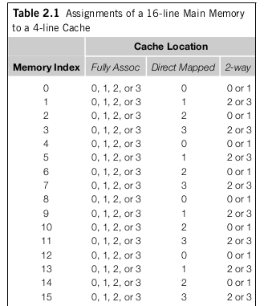

# Caching
*Cache* is a collection of memory locations that can be accessed in less time than some other memory locations. CPU cache is memory locations than the CPU can access more quickly than it can access main memory. CPU cache is located on the same chip on the CPU or on a separate chip that can be accessed much faster than an ordinary memory chip.

What should you store in cache? instructions that are nearby (Spacial locality) and instructions that were just used (temporal locality). In order to do this, a memory access will end up being on a block of memory instead of only the specific memory location desired. These blocks of memory are called *cache blocks* or *cache lines*.

Cache is divided into levels. L1 is smallest and fastest. L2, L3, ... are slower and larger. Some caches duplicate information in that if something is in L1, it will also be in L2. However, not all cache schemes do this. Note that in both cases, if something is in cache, it MUST be in main memory.

When CPU needs to access an instruction or data, it works down the cache hierarchy (L1 -> L2 -> L3 -> Main Memory). If the desired memory location is found in cache, it is called a cache hit. If not, it is a cache miss.

When there is a cache miss when the CPU tries to read data or an instruction, the CPU will read that memory location from Main Memory. Then, the CPU stores that memory location in cache. This makes it so that cache misses are extra expensive.

When CPU writes data to a cache, the value in the cache and the value in main memory are different or *inconsistent*. There are two basic ways to deal with this inconsistency.
* write-through caches: line is written to main memory when it is written to cache.
* write-back caches: data isn't written immediately. The updated data in the cache is marked as dirty and when the cache line is replaced by a new cache line from memory, the dirty line is written to memory. Basically, lazy loading. :)

## write-through cache versus write-back cache
* write-through cache ensures permanent storage. In write-back, data may be stored only in cache. If the computer dies, cache is reset, main memory is not. Thus, your information would be lost in write-back.
* write-back lazily writes into main memory which makes it faster.
* write-through is good for applications that write and then re-read data frequently.

Once you fetch line from main memory, where should you store it in cache? The two extremes are *fully associative cache* and *direct mapped cache*.

Fully associative cache places the new line at any location in the cache. Direct mapped cache places the cache line in a unique location in the cache to which it will be assigned. Intermediate cache mapping techniques are called n-way set associative.

For fully associative cache or n-way set associative cache, you also have to determine which of the potential lines you want to  *evict* when you add a new line into cache. The most common scheme to determine this is *least recently used*. Note that this does not apply for direct mapped cache since there is only one possible line you can replace.
