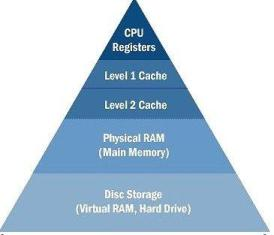

Class 2 Terms
=================

## Caching
data duplicating original resources stored elsewhere on the computer in order to speed up access to those resources
## multilevel cache

multiple levels of cache that get slower, cheaper, and larger in size as you go down the hierarchy
## pipelining
breaking down an instruction into smaller parts in order to run multiple instructions at the same time
## vectorization  
a style of programming where you generalize operations on scalars to apply transparently to vectors.
## loop unrolling
optimize a programs execution speed by making it so that you are doing less overhead work by iterating through the loop less. You do multiple iterations of the work inside a single iteration. This takes advantage of caching.
## code hoisting

## loop invariants
## compiler switches and optimization
## pointer arithmetic
## SLURM
## ssh
