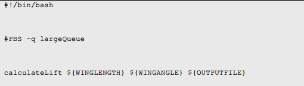

High-Throughput Computing in the Sciences
============================================

To get faster computers, people have to start making use of parallelism.

There are two main types of parallel computing - *capability parallelism* and *capacity parallelism*. Capability parallelism (true parallelism) refers to a single large application running on many computers at the same time and with various parallel components communication among themselves. Capacity parallelism involves many copies of an application all running simultaneously but in isolation from one another.  This second type of parallelism is called *high-throughput computing (HTC)*.

HTC only requires parallelism in initial setup and final communication of results.  

### What is a high-throughput computing application?

HTC applications are a number of identical programs each running simultaneously on a group of computers and each working on a different set of input data.

An HTC application tends to sweep through all the possible inputs and create a mapping of inputs to results.

HTC applications start as normal sequential applications and then someone decides to run the application with a wide variety of inputs and then you have a HTC application.

### HTC Technologies

##### Scripting Languages
Scripting languages provide a easy way to organize, launch, monitor, and collect results from various parallel job instances.

Common scripting languages include: BASH, CSH, KSH, Python, Tcl, and Perl.

##### Batch Queuing Systems
Batch systems are large pieces of software that monitor and manager large clusters of machines for the purpose of giving resources to jobs that request them. Batch systems maintain a list of jobs that users want to run and assign computers to those jobs as resources become available.

Most batch systems take in a job description file or submission script that describes the job that a user wants to run. When submitted by a submitting tool, the job description file tells the queuing system how to run the job and what resources are required to run the job.  

Batch systems generally have 2 kinds of jobs: sequential and parallel. In this case, parallel jobs means tightly-coupled, true parallel jobs. Sequential jobs refers to a single job that a user wants to run exactly once on a computer. To run a HTC application,  users queue up a large number of copies of the sequential jobs with varying inputs.

Normally, a simple bash file with specific input considerations, a given command to run, and output file are specified and run. A large number of these jobs are submitted and once they finish, separate code is written to merge the results.

##### High-Throughput Computing Examples

*Data Transformation*  
This is when you take large amounts of data files and perform some calculation based on them. It is usually a good idea to create a control script which iterates through all the files in a data directory and creates a job script for each file and runs it. The job script that you create should be based on a template.

Job Script Template:  

Control Script:

A key line to note is the qsub line which substitutes the variables inside the job script template for the desired values as per the loop in the control script.

#####  Problem Decomposition
You should decompose the larger problem in a way such that you have a manageable number of smaller problems, and such that you are likely to end up with the correct answer. aka, we want scalability, efficiency, and correctness.

You generally want the single unit of the HTC application to be 100 times or more greater than the amount of time it takes to process a trivial job. This way, the bulk of the time is spent doing your work, rather than on the setup of of the batch system.

You generally want to decompose the problem enough so that you have a predictable/similar amount of time that each job takes. This

##### Iterative Refinement
Submit a portion of the jobs and then use those results to create new set of jobs and run those. This occurs when you do not know the result space and it is too costly to just run all possible inputs. You try and narrow down where to run more specific jobs at each iteration.

### Resource Restrictions
there can be many restrictions on how many resources you can use. Of course you have restriction on resources built into the batch system, but the idea is to generally specify your own restrictions in your own bash scripts in order to optimize resource usage per script.
### Checkpointing  
periodically recording your data so that if things go wrong with the batch system, you do not have to restart all work. This creates extra work as now you have to determine how/when to store checkpoint data, how to restore from checkpoint, figure out when script failed, and restart script.
### File Staging
Copy a file from the source to the compute node. With shared filesystems, you don't have to necessarily do file staging, but this is not always the case.  
### Grid Systems
