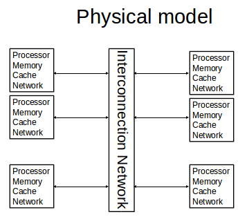
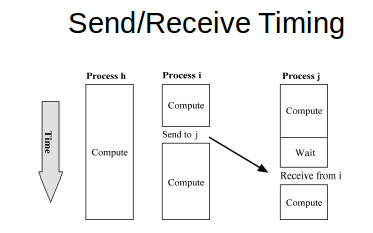
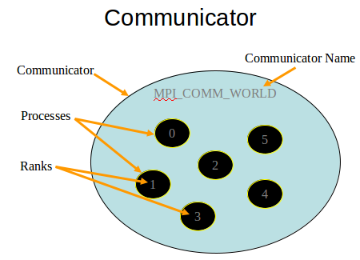

Lecture 13 - MPI Basics
==========
### Message passing concepts
link-level versus interface level - if you define something in link-level then you are basically affecting how references to things are creating. Not how the objects actually are.
  * thus can't take something in MPI and port it to another platform
  * this means that you have to compile on multiple different programs

nodes are connected by an interconnection network (IN)
  * n nodes, k processes
  * process are address space disjoin - processes share nothing
  * processes communicate by sending/receiving messages.
  * A message is an array of, possibly typed, bytes
  * May be more than one process per node – but that is not relevant to model
  * data coercion - convert data from one format to another
    * you have to do a lot of data coercion to work with multiple nodes

* processor talks to interconnection network

* have processes 0-n-1.
* looks like direct connection logically
* can send any message to anything else
* can send up to 256 bytes
* each machine needs sufficient

* to get data from left to right, you copy data from system to buffer.
* then, buffer transfers to target machine buffer
* target machine buffer then sends it to destination program
* there can be more copying going around in this transfer that are not shown
* if you send directly, then less copying

* all processes happening in parallel
* send to j -> receive from i takes time

### MPI basics, init, send/receive
Send(addr destination, char * data, int length)
  * Synchronous or asynchronous
    * Synchronous - blocks to until the buffer is full  
    * asynchronous - does not block
    * randez-vous -
  * Buffered or unbuffered - buffering means that you have more copying of data from one memory location to the buffer to the receiver
  * Reliable or unreliable
    * MQ and TCP are reliable.
    * UDP/IP not reliable
  * Broadcast or to a particular destination

Receive( addr * source, char * buf, int * length)
  * Blocking or non-blocking
  * Buffered or non-buffered
  * From anyone, or from a particular source

hint: It's good to set up a recieve and then check to see if message arrives.

##### how to get max age among numerous processes

assume multiple processes representing 1 person each  
want to figure out max age

key questions:
* how many tasks there are?
  * you can send broadcast and ask who exists. SLOW
  * have all processes send to 1 master process

You have to think about the algorithm you choose very carefully

Possible ways
* master/slave
* ring
* tree

##### initialize MPI
when mpi is run the number of processes is determined and fixed for the lifetimeof the program
  -mpirun -np 16 myprog

each process is running a copy of your program

each copy has its own global variables, stack, heap, and PC. It also has MPI library.

KEY: `do not mess with argc and argv before calling MPI_Init`

    MPI_Init (&argc, &argv);

* First MPI function called by each process.
* This is not necessarily first executable statement.
* You need to allow system to do any necessary setup.
* establishes default communicator

###### Communicators
Communicator: opaque object that provides message-passing environment for processes

We only have to use MPI_COMM_WORLD

MPI_COMM_WORLD
  * default communicator
  * Includes all processes

We can create new communicators, but won't in this class

* note each process is address space disjoint
* you can rank processes

##### Determine number of processes

    MPI_Comm_size(MPI_COMM_WORLD, &p)

* first arg is communicator
* number of processes is returned through second argument

##### Determine process rank

    MPI_Comm_rank(MPI_COMM_WORLD, &id)

* first arg is communicator
* rank is returned through second argument
* process rank range is 0-(p-1)

##### Shuttingdown mpi

    MPI_Finalize()

* Call after all other MPI library calls
* Allows system to free up MPI resources

##### Sample program

    #include <stdio.h>
    #include "mpi.h"
    int main(int argc, char * argv[]) {
      // Initialize MPI
      MPI_Init(&argc, &argv);
      // Get the processor number of the current node
      int rank;
      MPI_Comm_rank(MPI_COMM_WORLD, &rank);
      // Get the total number of nodes
      int numNodes;
      MPI_Comm_size(MPI_COMM_WORLD, &numNodes);
      char name[32];
      int length;
      MPI_Get_processor_name(name, &length);
      printf("%s has the rank %d out of %d nodes.\n", name, rank, numNodes);

      //KEY: you will have a lot of processes running. you can attach to a given process and see its output

      fflush();  // Flush all of the output streams
      MPI_Finalize();
    }

NOTE: we have NO CLUE what the order of the print statements is

##### MPI_Send

    int MPI_Send (
      void         * message,
      int           count,
      MPI_Datatype  datatype,
      int           dest,
      int           tag,
      MPI_Comm      comm
    )

all of these args are contiguous in memory
* datatype
* dest - rank of destination
* tag -
* comm -

This is a Synchronous send. You know that the message has been sent when the function returns. Thus, when you return from send, you can use the buffer again.

If this were asynchronous send, then you have to wait until your data is sent.

##### MPI_Recv

    int MPI_Recv (
          void         * message,
          int           count,
          MPI_Datatype  datatype,
          int           source,
          int           tag,
          MPI_Comm      comm,
          MPI_Status   * status
    )

* datatype
* count - number of data types
* THUS, max amount of memory being sent are: datatype * count

 You can use status field to know whether asynchronous call is done or not.

##### coding send/recieve

    …
    if (ID == j) {
      …
      Receive from I
      …
    }
    …
    if (ID == i) {
      …
      Send to j
      …
    }
    …

MUST BE IN CORRECT ORDER. recieve before send. if you fail to do this, then deadlock will occur.

##### inside MPI_send and MPI_Recv

????

##### Return from MPI_Send
Function blocks until message buffer free

Message buffer is free when
  * Message copied to system buffer, or
  * Message transmitted

Typical scenario
  * Message copied to system buffer
  * Transmission overlaps computation

##### return from MPI_Recv
Function blocks until message in buffer

If message never arrives, function never returns

##### Deadlock
KEY: bad code may work on small sample size. the deadlock will likely not occur on small sample size.

Deadlock: process waiting for a condition that will never become true

Easy to write send/receive code that deadlocks
  * Two processes: both receive before send
  * Send tag doesn’t match receive tag
  * Process sends message to wrong destination process
  * Both send large messages to each other first, then receive. Too big for buffers.

### Example, simple, static workload distribution
This is a simple static work distribution with no communication.

##### Circuit satisfiability
Circuit satisfiability is NP-complete
No known algorithms to solve in polynomial time
We seek all solutions
We find through exhaustive search
16 inputs  65,536 combinations to test

this is pleasingly parallel

### Homework 4
`VERY HARD`
Start as soon as possible.

##### Common problems people make in this hw
* processes have to exchange information. do NOT have both processes waiting for each other.
  * you want half of processes to wait, and then other half send
  * mistake people make is that you exchange data sequentially left to right. This is slow.

#### Other Tips
* start with 8 processes and work up from there
* want to make sure logic works for boundaries and then
* to get all data in 1 file
  * either figure out offset for each node's content in the file
  * simpler thing, at end of computation, node dumps to file  
