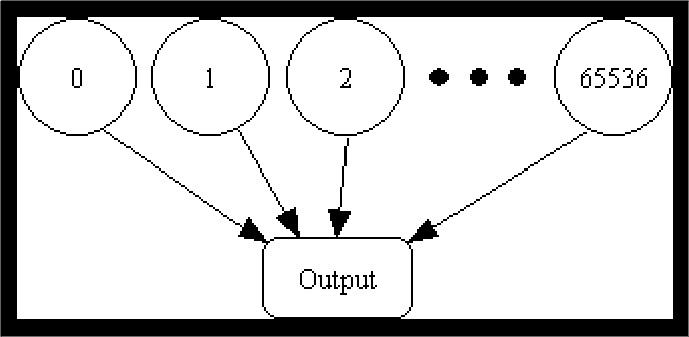
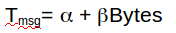
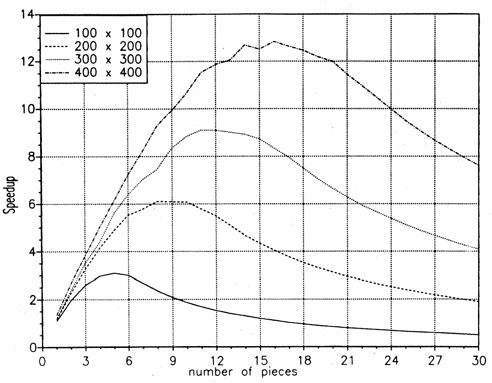

Lecture 14
==========

### Example, simple, static workload distribution
This is a simple static work distribution with no communication.

##### Circuit satisfiability
Circuit satisfiability is NP-complete. There are no known algorithms to solve in polynomial time. We find through exhaustive search of all possible solutions.

16 inputs -> 65,536 combinations to test

  * this is pleasingly parallel

##### Solution using cyclic (interleaved) allocation
assume p processes  
each process gets every pth piece of work. For example,
* p0: 0,5,10
* p1: 1,6,11
* p2: 2,7
* p3: 3,8
* p4: 4,9

    #include <mpi.h>
    #include <stdio.h>

    int main (int argc, char * argv[]) {
      int i;
      int id;
      int p;
      void check_circuit (int, int);

      MPI_Init (&argc, &argv);
      MPI_Comm_rank (MPI_COMM_WORLD, &id);
      MPI_Comm_size (MPI_COMM_WORLD, &p);

      for (i = id; i < 65536; i += p)
        check_circuit (id, i);

      printf ("Process %d is done\n", id);
      fflush (stdout);
      MPI_Finalize();
      return 0;
    }

This code
* uses MPI_Init
* determines the rank of the current processes using MPI_Comm_rank
* deterines total number of processes using MPI_Comm_size
* runs check_circuit function on all value from cur to 65336 incrementing by the number of total processes that exist. This allows for say process 0 to do 0, 5, 10.

The check_circuit function is

    // Return 1 if 'i'th bit of 'n' is 1; 0 otherwise
    #define EXTRACT_BIT(n,i) ((n&(1<<i))?1:0)

    void check_circuit (int id, int z) {
        int v[16];        // Each element is a bit of z
        int i;

        for (i = 0; i < 16; i++) v[i] = EXTRACT_BIT(z,i);

          if ((v[0] || v[1]) && (!v[1] || !v[3]) && (v[2] || v[3])
            && (!v[3] || !v[4]) && (v[4] || !v[5])
            && (v[5] || !v[6]) && (v[5] || v[6])
            && (v[6] || !v[15]) && (v[7] || !v[8])
            && (!v[7] || !v[13]) && (v[8] || v[9])
            && (v[8] || !v[9]) && (!v[9] || !v[10])
            && (v[9] || v[11]) && (v[10] || v[11])
            && (v[12] || v[13]) && (v[13] || !v[14])
            && (v[14] || v[15])) {
              printf ("%d) %d%d%d%d%d%d%d%d%d%d%d%d%d%d%d%d\n", id,
                 v[0],v[1],v[2],v[3],v[4],v[5],v[6],v[7],v[8],v[9],
                 v[10],v[11],v[12],v[13],v[14],v[15]);
              fflush (stdout);
        }
    }

Key features of this code
  * intended to check whether the zth portion of the pattern is satisfiable
  * the multiple checks run in variable time because the boolean expression doesn't do all computations if it can decide if a statement is true or false early on
  *  note the fflush after the printf

##### Key questions to ask of solution code
assume n pieces of work, p processes, cyclic allocation

* what is most pieces of work any process has?
* what is least pieces of work any process has?
* how many processes have the most pieces of work?

for example, assume n=10, p=3
* 0: 0,3,6,9
* 1: 1,4,7
* 2: 2,5,8

Most work is 4 pieces of work. Process 0 has most work. Process 1,2 have least work. Only 1 process has most work.

The key thing to do is `decrease how many processes have most work`. Thus if process 0 were doing 5 pieces of work, then you'd move 1 piece of work to some other process.

##### Program run and output
Program is run using different number of processes:
  * mpirun -np 1 sat
  * mpirun -np 2 sat
  * mpirun -np 3 sat

Note that processes are running in parallel thus will have random amounts of work that they each do.

##### Enhancing the program
We currently simply print out all solutions. We want to change the program to find the total number of solutions. This requires *communication*!

We will wait for all processes to end and then do a global sum.

We will also incorporate *sum-reduction* into program.

Reduction is a **collective communication** function - communicate among all processes in a process group
  * For example, MPI_Reduce takes data from all processes in a group, performs an operation (such as summing), and stores the results on one node
  * there are numerous collective communication functions in MPI

The specific code modifications will be
  * check_circuit will
    * return 1 if circuit is satisfiable with input combination
    * return 0 otherwise
  * each process keeps local count of satisfiable circuits it has found
  * perform reduction after for loop

new code:

    int count;  // Local sum
    int global_count; // Global sum
    int check_circuit (int, int);

    count = 0;
    for (i = id; i < 65536; i += p)
      count += check_circuit (id, i); //count num circuits returning 1

`Usually it is just as fast to reduce on vector as on scalar`

##### Prototype of MPI_Reduce()
This function takes data from all processes in a group and performs an operation (we will using summing) and store the result in one process.

`when in doubt, minimize number of scalars`

`all processes **must** get to reduction point. If one of the processes doesn't have this point, then program will deadlock.`

    int MPI_Reduce (
        void         * operand,   // addr of 1st reduction element        void         * result,    // addr of 1st reduction result
        int          count,       // reductions to perform
        MPI_Datatype type,        // type of elements
        MPI_Op       operator,    // reduction operator
        int          root,        // process getting result(s)
        MPI_Comm     comm         // communicator
    )

##### MPI datatypes
* MPI_CHAR
* MPI_DOUBLE
* MPI_FLOAT
* MPI_INT
* MPI_LONG
* MPI_LONG_DOUBLE
* MPI_SHORT
* MPI_UNSIGNED_CHAR
* MPI_UNSIGNED
* MPI_UNSIGNED_LONG
* MPI_UNSIGNED_SHORT

##### MPI_Op
* MPI_BAND
* MPI_BOR
* MPI_BXOR
* MPI_LAND
* MPI_LOR
* MPI_LXOR
* MPI_MAX
* MPI_MAXLOC
* MPI_MIN
* MPI_MINLOC
* MPI_PROD
* MPI_SUM

##### call to MPI_Reduce

    MPI_Reduce (&count,
            &global_count,
            1,
            MPI_INT,
            MPI_SUM,
            0, //only process 0 will get the result
            MPI_COMM_WORLD);

    //process 0 stop
    if(id ==0) printf("there are %d diff solutions\n", global_count)

* note, no for loop required or anything. just have to call this at end of all processes.

### Benchmarking the program

mpi_barrier is the same as barriers with threads. It is used for synchronization. It blocks all processes until all processes get to barrier point.

mpi_wtick - timer resolution

mpi_wtime - current time

these things can be used to get the time

code:

    double elapsed_time;
    …
    MPI_Init (&argc, &argv);
    MPI_Barrier (MPI_COMM_WORLD);
    elapsed_time = - MPI_Wtime();
    …
    MPI_Reduce (…);
    elapsed_time += MPI_Wtime();

##### superlinear speedup
It is possible to get superlinear speedup in a program.

This occurs when the original program is not effectively taking advantage of cache, but then the parallel version is more granular so the smaller chunks are better able to fit into cache.

### scheduling scheduling
Static scheduling - the chunks can be pre-computed as well as decided how to scheduled to threads during compilation itself

Dynamic scheduling - same functions as static scheduling but done at runtime. You can also have more complex mechanisms like deadlock handling mechanism, load handling, etc..

in message passing system, time to dequeue something is too slow so don't normally use static scheduling as you cannot account for that beforehand.   

### Computation Granularity
In a message passing system, it is very important to understand computation granularity. Why? Message passing takes time. It is much slower than memory access.

Message passing is the slowest part of parallel systems.

Thus the considerations you have to think about are:
  * Message cost
  * Grain size
  * Impact of grain size
  * Tightly coupled versus loosely coupled

##### message cost

  * Tmsg = time to do work
  * alpha = initial cost to do anything
  * beta = per byte cost of doing more stuff

  * the linear function is what the message cost equation leads to
  * the jagged curves simply are meant to show that in real life, there are lots of hardware tricks involved used to speedup work. Thus things aren't as linear as the message cost equation may lead you to believe. Still, the idea is still there.  
    * circuit switched network - hardware establishes path from src -> dst. it creates a fixed routing table from src to dest. Each router in the path is reserved. *So no buffering in the network at all*. Very fast.
      * hardware trick: you have to establish the connection by sending packets. if message is short enough, then simply send the message instead of establishing path.

  * this equation usually only holds on an idle network
  * this equation is really a function of application topology, network topology, and number of processors.

##### key ideas
grain size = time spent computing / time spent communicating
  * As grain size shrinks (more time spent communicating), performance decreases.

As alpha increases, performance goes down.

2 networks can exist in super computer.
  * alphas can be very different between networks
  * not all applications are equally sensitive to alpha
  * if length of message is long, then large alpha affects program a lot.
  * if focus of application is on communication, then large alpha affects program a lot more

`if alpha is relatively larger than beta (high initial cost), then you want to focus on reducing the number of messages sent`.

`if beta is relatively larger than alpha (high cost with increasing data size), then you want to focus on reducing how much data is sent per communication`

If we hold the amount of computation fixed and increase the number of processors then

  * this is a very typical performance curve
  * for each given problem size (100x100 or 200x200...)
    * performance is linear at first
    * then it plateaus
    * then you have too much communication and it slows down
    * thus once you are at peak, you should *no  longer add processors*
  * increasing problem size has same thing, but at larger increments.

##### Moral of story
we must balance computation ratio with relative speed of the network and processor

YAGG - larger grain implies less parallelism

### hw help
if you do it as horizontal blocks(rows), then it is much easier.

iters_per_cell - we  have 2 plates (old,new). he is saying that you do an extra for loop
  * the point is to make computations slower. we are trying to make it more granular. observer differences in parameters.  

    for i iterations:
      for ...  <- add this. DO NOT do this extra dumb operation in the most inner for loop else it will. no useful work being done. just redoing work already done.
        do_iter

boundary_thickness - you want extra row from bottom and top of row. Because you will need them from neighboring blocks.
  * cur block needs to receive 1 row from below and 1 row from above.
  * cur block needs to send top row up 1 block and bottom row down 1 block  
  * ghost cells and boundary cells explained in book
   * whether this is a good idea or not is dependent on alpha
    * alpha is low on rivanna so less computation is better. You want to send more messages.

we are doing 1d decomposition

avoid zipper

to change granularity level, change iters_per_cell past 1.

Ways to make it scream
* asynchronous send and asynchronous receive
