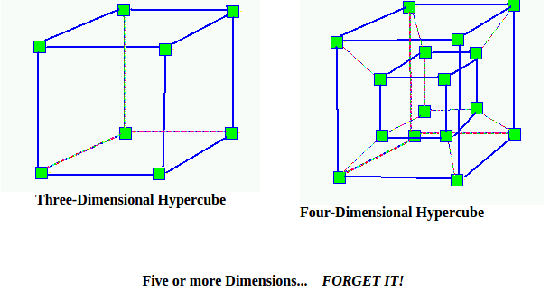

Lecture 15
===========
There are two types of networks - *packet switched* and *network switched.*

### packet switched
Packet Switched networks send packets of information one by one to each node. A given node has a buffer or a queue on both its receiving and sending end.

The problems with this system are
  * a node may be too full and may drop your packet
  * tree saturation from nodes getting backed up and then propagating their delays to peers

### Circuit Switched
Circuit Switched networks have packets lock their path. There is a slow initial connection to establish path. Then, the actual packet is sent without much delay through the path.

When making the initial connection, your seeker signal can be blocked when it gets to a node and the node is being used. In this scenario, the signal has options
  * wait for node to open
    * if you ONLY hold, then you could deadlock the network. This will occur because you will have too many initial signals just waiting for each other to finish. Your connection will not go through until others are done.
    * The way to avoid this deadlock is to always choose route paths in a particular order.  
      * The problem with particular paths is that you may end up blocking even though there is a perfectly good path for you to take. You just have to follow your order.
  * find another node
  * just stop and let initial sender know

### symmetrical d-dimensional lattice

  * this is a symmetrical d-dimensional hypercube
    * symmetrical = all faces are the same
    * d-dimensional = there are d dimensions
    * lattice = square/diamond shape
  * any partition to this symmetrical d-dimensional hypercube is called a *symmetrical d-dimensional lattice*
    * For Example, for a 3d hypercube,a 3d lattice is just a plane

  * A d-dimensional hypercube will be named by d-digit binary number.
  * the number of digits is d
  * from a given vertex, you can go to another by changing only one bit
  * *if you always go in the same order, then you will be deadlock free*

### Features to look for when determining whether a system can scale
We are only concerned with symmetric systems.

You want to be able to just increase size of machine and still allow it to scale. The key bottleneck is the communication network. As the problem size grows, the thing that you become most concerned with is the communication network.

Thus you want to consider the features of a communication network. These include
  * *Network Diameter* - largest distance between two switch nodes.
    * Low diameter is better because the diameter puts a lower bound on the complexity of parallel algorithms requiring communication between arbitrary pairs of nodes.
    * you do not want to only consider this because only considering this will lead you to always choose bus or crossbar, but these aren't always the best options.
    * also, network diameter doesn't reflect number of nodes in between nodes. you only are concerned with physical distance between two furthest nodes.
  * *Bandwidth* - data/time
    * *Link Bandwidth* - how much data can you move over some amount of time
    * *Bisection Bandwidth* - if you cut graph in half, how much data can you send across that cut.  
      * if you decide to cut a network into two halves, you want to cut so that you properly divide the network into the two halves using the minimum number of edges. Remember that the max-flow min-cut theorem means that the maximum network flow = min-cut. Thus, bisection width simply is a way for me to determine the maximum network flow. I want maximum network flow and thus I want maximum bisection width.
    * Another way to think about this is that the given more edges between the various parts of a large graph, the more ways a large data set can transfer information.  
    * Determining bisection bandwidth is difficult.
  * *Node Connectivity* - how many out links do you have from every machine.
    * generally, more nodes is good. However, what you really want to look at is cost function. You want to optimize number of out links with cost
  * *Mean Internode distance* - average distance between nodes
  * *Expansion* - if you have machine of size n, and want to build machine of size n+1. What is the cost to make the n+1 sized machine.
    * basically, what is cost to make the machine bigger
  * *Edges per switch Node* - it is best if the edges per switch node is a constant independent of network size because then the processor organization scales more easily with larger amounts of node.
  * *Constant edge length* - It is best if the maximum edge length is a constant independent of network size. This allows for easier scalability.
  * *cost* - having more nodes is more expensive. Thus, though crossbar has low diameter, high bisection width, constant edges per node, and constant edge length, it is too expensive to actually use.

### Key Assumptions for Calculations
* message = unit of work
  * message traverses some number of links
  * on each link, link will take some time to process
* computation at nodes is constant
* S_pe = service time at processing element (node)
* S_cl = communication time between communication links (in between nodes)
* assume all nodes have same message routing distribution
  * uniform routing distribution - target of a message is uniformly distributed
  * nearest neighbor - only send messages to nearest neighbor
   

### Calculations
Performance bounds
  * some devices will saturate before others
  * V_iS_i (visit ratio * amount of server)- average amount of service request at device i by each message
    * when this is 1, this device is saturated
    * prob that each will land on it is 1
  * x0 = rate at which we process messages
  * x0 <= 1/ V_bS_b  (max ratio of service)
    * something on the denominator will eventually be saturated.
    * V_bS_b = max_i(V_iS_i)

granularity
* scales
* K= number of nodes
  * all nodes are ???
  * thus V_pe =1/k (visit ratio)
    * have k nodes. What is probability that you will go to a particular node?
      * uniform routing: 1/k
      * ? routing: 1/k because you will pick among only k things. Nodes are uniformaly distributed
        * assumoption: network looks same no matter where you are
* V_peS_pe = S_pe / k
* assertion: "system is balanced when V_peS_pe = V_clS_cl"
* S_pe / S_cl = V_cl / V_pe
  * service time on process / service time on communication link
  * this is similar to granularity ratio
* S_pe / S_cl = V_cl / V_pe  = K*V_cl
  * computational ratio (or granularity) must be ? if ? is not going to dominate

### some computations
l_max = network diameter
LV = mean number of links crossed
phi(l) = probability of message crossing exactly l links
V_cl = link message intensity
LV = sum(l=1 -> l=l_max, l*phi(l))
V_cl = LV / num links

##### uniform
BUS

lmax = 1
phi(1) = 1
LV = 1

V_cl = 1/1 = 1

optimal granularity is thus: S_pe / S_cl = V_cl / V_pe = 1 / (1/k) = k
bus doesnt scale because ???

##### sphere of locality
##### decreasing probability
