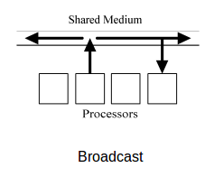
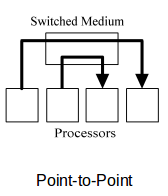
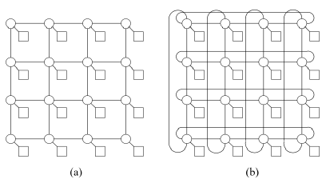
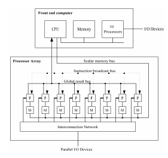
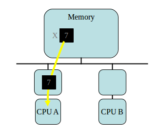
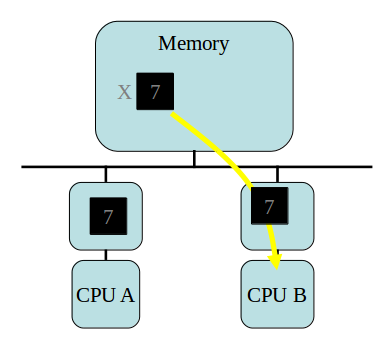
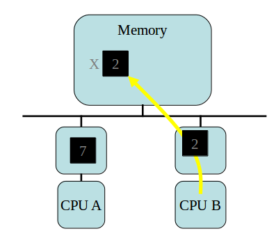
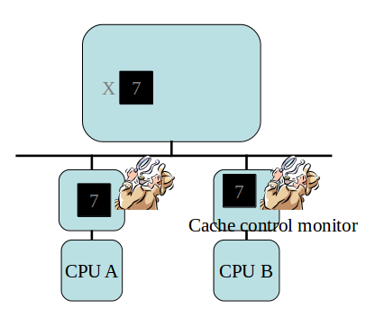
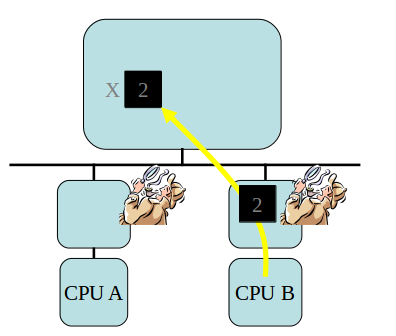
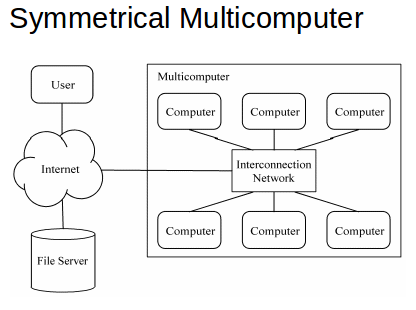

Lecture 4
==========

### Interconnection Networks
Interconnection networks connect processors to shared memory and processors to each other

Interconnection Networks pretty much drive how fast our programs will run

There are two interconnection media types
* shared medium
* switched medium

There are two opposite extremes in network design: *bus* and *fully connected network crossbar*. You want to find something in the middle to balance out both extremes

A bus is when you have a single connection between all processors. A bus provides
* good cost scalability - dont add any more connections with increasing number of processors
* poor performance - more processors end up having to share the same bus

A fully connected network (crossbar) is when you have a direct path between each component in the system. This yields
* good performance
* poor cost

A bus has bandwidth of 1, latency of 1.  
A crossbar has bandwidth of n, latency of 1.

bandwidth=rate of data transfer (bits/sec) from node to node

latency=time delay (sec/bit) between start to finish of data transfer

##### Shared medium
 

Key features of shared medium interconnection networks
* only one message is passed at a time
* messages are broadcast - each processor listens to every message
* arbitration (determining which value is correct when there is conflicting data) is decentralized
* collisions require resending messages

An example of shared medium interconnection network is ethernet.

##### Switched medium

Key features of switched medium interconnection networks
* point-to-point messages between pairs of processors
* each processor has its own path to switch

Key advantages switched medium has over shared medium
* multiple messages can be sent simultaneously
* allows scaling of network to accommodate increase in processors

##### Switched Network Topologies
You can view a switched network as a graph where
* vertices's are processors or switches
* edges are communication paths

You end up with two kinds of topologies - *direct* and *indirect*.

Direct Topology is when the ratio of switch nodes to processor nodes is 1:1. This means that there is an equal number of switch nodes as processor nodes. For this to happen, you must have it be the case that every switch node is connected to either *1 processor node* and *atleast 1 other switch node*.

Indirect Topology is when the ratio of switch nodes to processor nodes is greater than 1:1. Thus you have more switch nodes than processor nodes. In this scenario, some switches just connect to other switches.

You can evaluate switch network topologies using the following characteristics
* diameter - largest distance between two nodes
* bisection width - minimum number of edges that must be removed to divide the network in half
* number of edges per node
* whether there is a constant edge length or not
* number of edges

### Evaluating Network Topologies
Again, the criteria is
* diameter - largest distance between two nodes
* bisection width - minimum number of edges that must be removed to divide the network in half
* number of edges per node
* whether there is a constant edge length or not
* number of edges

##### 2D meshes

Features:
* switches arranged into 2D lattice
* communication allowed only between neighboring switches
* direct topology
* the righthand side image is a variant where you have wraparound connections between switches on edge of mesh
  * the lefthand side is called a grid, the wraparound version is called a taurus
  * taurus has rings to shorten diameter by half
  * grid: diameter is length*(width-1)
  * taurus: diamter is length*(width-1) / 2

### Architecture Types
* processor arrays - SIMD/ data parallel
* multiprocessors - shared memory
* multicomputers - distributed memory

most machines are hybrid

##### Processor arrays (SIMD/data parallel)
A *Vector computer* is one that has an instruction set that includes operations on vectors as well as scalars. There are two ways to implement vector computers
* *pipelined vector processors*: streams data through pipelined arithmetic units. This is generally used for small scale.
* **processor array**: many identical, synchronized arithmetic processing elements. Genereally for large scale.

Motivation for processor array:
* control units were expensive so a single control unit with lots of computation units was much cheaper.
* scientific applications have lots of data parallelism

An example Processor array diagram:

Things to note:
* front end computer talks to backend processor array
* front end has CPU using buses to talk to processor array processors
* each processor in the processor array has its own small memory unit
* the is able to take the data the front end gives it and split it up in parallel between all processing units at once
* the processors are connected via an interconnection network

The front end computer contains the program. It manipulates the data sequentially. It then sends the data to the processor array for fast computations. Thus the front end computer controls the processor array. The processor array does in fact manipulate the data in parallel.

##### Performance of Processor array
*Performance* : work done per time unit

The performance depends on
* speed of processing elements
* utilization of processing elements

Key thing to note is that if you have x processors, then you can run x or less tasks in parallel and thus a single time unit. If you have just x+1, then you end up having to wait double the amount because things cant be done in parallel. If you have x+1 tasks, then x-1 tasks in the second time unit will do nothing.

If then condition expressions are very slow in processor arrays, in that it requires two instead of one time second. What happens is that in the first time second, all the processors that have the if condition be true do their work, while the rest just wait. Then, in the second time unit, the rest do their work while the original group just sits there. Having anything just sit there is bad.

##### Processor Array Shortcomings
* not all problems are data-parallel
* speed drops for conditionally executed code
* do not adapt to multiple users well
* in the past, processor array did not scale down to starter systems. This is no longer the case.
* reply on custom VLSI for processors. It is better nowadays to just use the commercial ones because lots of progress has been made to speed them up.
* expense of control units has dropped

##### Multiprocessors (shared memory)
Multiprocessor : multiple-CPU computer with shared memory

In this system, the same address on two different CPUs refers to the same memory location

The benefit of this is that it avoids the three problems of processor arrays
* can be built using commodity CPUs
* naturally supports multiple users
* maintain efficiency in condition code

This image shows the difference between a single processor system versus a multiprocessor system. Basically, the multiprocessor duplicates the CPU/cache memory system numerous times. It connects all of them via the bus.

Note that memory is shared between all processes. Thus a given CPU sees the same memory locations as all other processors. However, the picture also shows that some memory units are more accessible than others. This leads to *uniform memory access (UMA) multiprocessors* and *symmetrical multiprocessors (SMP)*.

Uniform memory access (UMA) multiprocessors are those that take the same time to access any memory spot. This is done by having a large chunk of memory is accessible in the same way to each processor.

Symmetrical multiprocessors (SMP) matches memory to CPUs thus the memory that is specific to a given CPU will be much faster to access than other memory.

*Private and shared data*  
The UMA and SMP also imply the usefulness of private versus shared data.

private data: used only by a single processor   
shared data: used by multiple processors  

Processors can communicate by reading and writing shared data values

*shared data challenges*  
* synchronization
  * mutual exclusion - two processes shouldn't access same shared memory at the same time
  * barrier - process must stop at a barrier point and cannot proceed until all other processes reach this barrier point
* cache coherence

##### Cache coherence problem
Cache coherence problem:

write invalidate protocol:

Basically, problem is: cache for a given CPU will not know what has happened to other CPU's and how it is affecting real memory

Solution is: have each cache repeatedly check if someone is writing to the memory location that you have cached. If so, then invalidate your cache value.

#### distributed multiprocessor

Distributed multiprocessors distribute primary memory among processors.

Doing this leads to:
* increase aggregate memory bandwidth
* lower avg memory access time
* allow greater number of processors

This is how you have a multiprocessor that is non-uniform memory access (NUMA).

NUMA also has cache problems.
* some NUMA multiprocessors do not support the global cache in their hardware
  * only instruction and private data are stored in cache
  * fewer access to the fast cache means more access to slow memory
* cache coherence problem is more difficult to solve because there is no memory bus to "snoop" for
  * there exists a directory-based protocol to solve this issue

##### Multicomputers (distributed memory)
Multicomputer just means that memory is distributed among multiple different CPUs

Same address on different processors refers to *different physical memory locations*.

Processors in a multicomputer interact via message passing

You can have either *commercial multicomputers* or *commodity clusters*

*An asymmetrical multicomputer*  

Notably, front end computer connects directly to interconnection network which connects to numerous other computers

Advantages to asymmetrical multicomputers
* Back end processors dedicated to parallel computations  
  * easier to understand, model, and tun performance
* simple back-end OS  - cheap and easy

Disadvantages to asymmetrical multicomputers
* front end computer is single point of failure
* single front end computer limits scalability of system
* primitive OS in backend makes debugging difficult
* every application requires development of both front end and back end

*Symmetrical Multicomputer*  

features
* multiple access points to computer.
* each computer connected to intercommunication network
* the interconnection network is what is connected to internet

Symmetrical Multicomputer advantages
* remove the performance bottleneck of having a single front end computer
* better debugging support
* every processor executes same program

Symmetrical Multicomputer Disadvantages
* more difficult to maintain illusion of single parallel computer
* no simply way to balance program development workload among processors
* more difficult to achieve high performance while multiple processes on each processor

*commodity cluster*  
A Commodity cluster is very similar to multicomputer.

Feature of commodity cluster:
* co-located computers
* dedicated to running parallel jobs
* no keyboards or displays
* identical OS on each computer
* identical local disk images

Key difference between commodity cluster and multiple computer.
* low latency high bandwidth - multi computer
* high latency low bandwidth - commodity cluster

*Network of workstations*  
* dispersed computers
* first priority: person at keyboard
* parallel jobs run in background
* different OS on each computer
* different disk image on each computer
* users can turn off machines, thus checkpointing and restarting are important

*Distributed Memory programming model*
* communicating sequential program s
* disjoint address spaces
* communicate by sending messages
* message is an array of bytes
  * send(dest, char * buf, int len);
  * receive(&dest, char * buf, int &len);

### Flynn's taxonomy
Flynn's taxonomy is a way to classify machine based on number of instruction streams and number of data streams.

combinations:
SISD, SIMD, MISD, MIMD

In each of these combinations,
* S=single
* I=intruction stream
* M=multiple
* D=data stream

##### SISD
single instruction, single data

this is a single core uniprocessor system

##### SIMD
single instruction, multiple data

This include things like
* pipelined vector processors
* processor arrays
* GPUs

##### MISD
multiple instruction, single data

Example: systolic array

These aren't very common.

##### MIMD
multiple instruction, multiple data

This is most common. Examples include
* multiprocessor computers that we use on a day to day basis
* multicomputers - all of the ones that are mentioned in multicomputers section (symmetric/assymetric multicomputer, commodity clusters, network of workstations)
