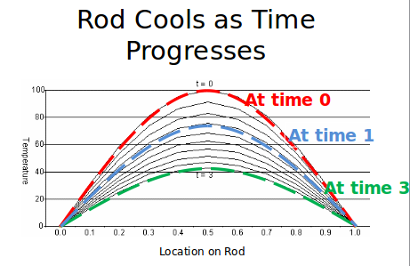
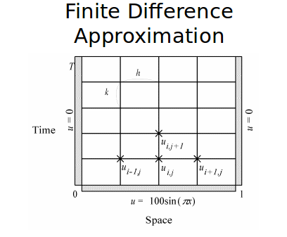

Lecture 6
==============
### High Throughput Computing (HTC)
HTC is when you have a bunch of jobs that are fairly independent and you just run them concurrently on a large number of nodes.

These are called "embarrassingly parallel", "pleasingly parallel", "bag of tasks", or "parameter sweep problems".

##### General HTC Issues
Overhead per job is substantial. You can usually get around this by bundling jobs up.

There might not be enough jobs to properly use all the resources you have. You can split up jobs to fix this.

IO system may be saturated (too heavily used). This can occur if you are copying large files in a given job. If you have a lot of jobs running and each needs heavy IO then this can seriously slow down your system.

There may be more jobs than the queuing system can handle. Many queuing systems break down at several thousand jobs.

Jobs may fail for no good reason. Thus you should always check for output and resubmit upto k jobs.  

##### Examples of when HTC is useful
for all files x, execute f(x,y)

explore parameter space in n dimension (paramater sweep problem)

Monte Carlo's - can run a sequential job for each bayesian model that you want to create

Rendering animations

### Fosters Design Methodology
1. Partitioning
2. Communication
3. Agglomeration
4. Mapping

### Boundary value Problem

What happens to the temperature of the rod over time?

Rod cools as time progress. At time 0, highest temperature. At time increases, temperature decreases. Note that the location on rod affects the temperature because locations closer to the ends will get colder faster.

This table is about figure out as time increases, what is the temperature of the rod at various spaces?

The X's are data points. The grid just means that we are computing specific values rather than some continuous function.

For this problem, the bottom three X are initial conditions. The upper X's value depends on the values of the bottom three X's. This makes sense as the next temperature will be dependent on what the temperature of the current and neighboring spots of the rod were at some previous time.

Thus a brute force solution is to basically determine the initial conditions (bottom row) and then iterate through each row and calculate each point by looking at the row right below it.

We will do this faster using parallel programming.

The *Partitioning* step involves us
* determining one data item per grid point
* associate one primitive task with each grid point
  * the primitive task would be to calculate the current point using the formula:
    * cur point = f(left neighbor at t-1, cur point at t-1, right neighbor at t-1)
* decompose the entire domain into a 2d set of points that we want to calculate.

The *Communication* step involves identifying communication pattern between primitive tasks. In this case, each interior primitive task has three incoming and three outgoing channels. This makes sense because each point is the result of the neighboring points in the row right below it.

The *Agglomeration and Mapping* steps involves determining how we can join the communications efficiently.

*going from (a) to (b)*  
All the circles are going up so it is probably best to do those going up communication on a single node. If we thus do this, then we have (b) where each circle represents a node. The going upper left and upper right communication for each node in (a) will thus be handled by the simply going left and right in (b).

*going from (b) to (c)*  
Suppose you only have 3 nodes but (b) apparently has 12 tasks (12 supposed nodes that are doing work). What you will have to do is split up the 12 nodes into 4 nodes each. That is what is happening from (b) to (c)

##### Calculating speedup
**speedup = sequential time / parallel time**

* X = time to update element
* n = number of rod pieces
* m = number of time steps
* p = number of processors
* y = message latency

sequential execution time = m * (n-1) * x
parallel execution time = m * (X*cieling( (n-1) / p) + 2y)

The sequential execution time is determined by the fact that
* each element takes X time to update
* the number of elements is going to depend on how many rod pieces we have (n-1) and how frequently we are measuring the temperature (m).
* note the rod is divided into n pieces. The intersections of those pieces are what you are measuring. Thus if you have 2 pieces, you actually only have 1 intersection. This is how you get n-1.  
* thus X is each given circle, m provides the rows, n-1 provides how many per row.  

The parallel execution time is determined by the fact that
* you have a normal number of tasks that can be performed thus you have to take the ceiling
* you take the ceiling of the number of circles per row divided by the number of processors because thats how you are splitting up the tasks. Thus now you have the number of circles per row: cieling( (n-1) / p)
* X * circles per row  to determine time per row.
* 2y provides the overhead to make each row parallel
* m to determine how how rows there are  

Note that this is a simplification of reality because caching and managing memory hierarchy is not included in these calculations.

### Reduction Problem

Note that the associate operator can be +, -, /, * , ...

Performing each term sequentially is slow. You want to speed this up by doing each operation in parallel.

1. Say you originally had n-1 operations to do.
2. After you do them all in parallel, you will have n/2 -1 operations to do.
3. Then, doing them again will yield n/4 -1 operations left.
4. Keep going until you have only 1 operation left.

Basically this turns a O(n) problem into O(lg(n))

We will do *parallel reduction evolution* which is basically just computing a portion of the problem and then passing the result to someone else. Think divide and conquer.

Each circle is a single calculation. At each step you do the given computations in parallel. Following the steps will yield a binomial tree of calculations. This tree will look like:  

Typically you will end up agglomeration on this which will group a set of terms together and do them sequentially and then parallelize the results of these.

### Summary

Parallel computation is best done when you
* have a set of tasks
* that interact with each other through channels

A good design of a parallel system
* maximizes local computations
* minimizes communications
* is able to scale up
