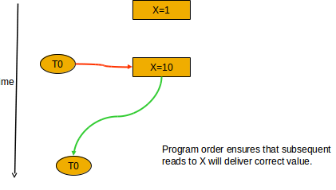

Lecture 7
==========
### Readings to do
* pthread
* 2 chapters in book
* paper on consistency symmantics **
* paper on type architectures     **
* readings on hot spots is key to do - will be on midterm, dont need to understand math **
* reading distributed symmetric memory (DSM)
* important to do these readings by thursday since that is when hardware stuff starts
* speedup discussions not covered in class, but will be tested. all from a given paper - ch 7 quinn

### Process vs Thread
Process is basic unit of work in timesharing system. Program in execution.
* program code
* pc, registers
* process stack
* data (global variables)
* OS resources (open file table)
* Accounting table

Creating process is slow due to
* lots of memory operations - many data structures must be allocated initialized
* go between user/kernel

Working with processes is slow because processes have no shared memory and so to make them communicate, you have to go down to kernel level

A thread is within a process. A process has an execution state. That execution state is called a *thread of control*, *thread*, or *lightweight process*.

A thread has
* basic unit of CPU utilization
* sequence of instructions being executed in a program
* its own execution state with
  * stack frame
  * PC
  * register set

A thread shares with other threads:
* code
* most data
* os resources and state

### Single versus multithreads

Each thread has its own registers and stack. Each thread shares code, data, files.

threads share the processes original stack. This means that you have to be careful with how much you put on each thread, because you can overwrite other stack without knowing.

### Kernel threads

There are multiple kernel and user threads.

The key reason you want kernels to support threads is that if a user thread enters the kernel, it can block the entire process for things like IO. If kernel knows about these things, the other threads can keep going.

### message passing versus shared memory
The goal of message passing and shared memory is share data. However, one of the key things you have to be careful about is maintaining data consistency.

##### message passing
Message passing - kernel does synchronization for you.

send/receive functions are built into OS and so the OS does both communication and synchronization for you. Thus you have **implicit** synchronization between sender and receiver.

##### share memory
communication is via shared variables that occur in some shared namespace (address space of threads)

This is called **explicit** synchronization.
You have to do shared memory synchronization yourself.

*communication through time* - a thread writes value to memory location and reads it again later

*communication through space* - a thread writes value to memory location and a different thread reads it

You need to make sure that T1 is getting new value of x. You can do this via synchronization tools such as locks/mutexes, semaphores, barriers, events, monitors, ...

### shared memory synchronization methods
we need to control the order that events occur. This is different than the mutual exclusion problem where you simply don't want two things two accessing information at the same time. For us, **ORDER MATTERS**.

you can use semaphores or spin locks to do this.

##### spin locks
Spin locks basically wait using a while loop until the desirable conditions are true and then continue.

Spin locks uses up too much CPU time so don't use this often. Spin locks are for when there is a guarantee that the wait time is very small.

##### Semaphores
a semaphore is just an integer variable. You can only access the semaphore via signal and wait functions.

When one process modifies the semaphore, no other process can modify it.

binary semaphores can only be 0 or 1.

Binary semaphore example

    class semaphore{
      int value;
      semaphore(int val) {value = val;}
      wait();
      signal();
      ~semaphore();
    }

    wait():
      if value is 1 -> value is set to 0, caller proceeds
      if value is 0 -> calling thread is blocked and placed on a queue

    signal():
      if value is 1 -> caller continues
      if value is 0 -> there are 2 cases:
        if no thread is waiting -> value is set to 1
        if there are threads waiting -> one thread is released

Counting Semaphore example

    class semaphore{
      int value;
      semaphore(int val) {value = val;}
      wait();
      signal();
      ~semaphore();
    }

    wait():
      if value >=1 -> value--, caller proceeds
      if value <1 -> value--, calling thread is blocked and placed on a queue

    signal():
      if value >=1 -> value++, caller continues
      if value < 1 -> there are 2 cases:
        if no thread is waiting -> value is set to 1
        if there are threads waiting -> one thread is released

### locks
usually used for mutexes.

the simplest and most common type is spin locks.

modern OS's have a test_and_set hardware instruction that makes creating spin locks very easy and fast.

to implement locks, you can just lock the bus. This makes for the test_and_set instruction.

### Barrier
data structure.

initialize it with some value n. There are n threads. None of the n threads are allowed to go forward until all of them are able to come to the barrier location.

**For the hw, use a barrier data type!!!!!!**

### Event
similar to semaphore in that you wait on it.

Any number of threads can be put to wait.

When signaled, all threads waiting on event at that time are released.

### Deadlocks
synchronizing multiple threads can lead to deadlock where none of the threads can make forward progress.

Necessary conditions for deadlock:
* mutual exclusion - while a resource is being used, no other thread can use that resource
* hold and wait - a process is currently holding at least one resource and requesting additional resources which are being held by other processes.
* No preemption - a resource can be released only voluntarily by the process holding it.
* Circular wait - a process must be waiting for a resource which is being held by another process, which in turn is waiting for the first process to release the resource.

avoid them by
* avoid circular waits - ask for things in particular order
* have a list of things to wait for. Ask for them, or release them all at once

### livelock
like deadlock, but the states of the processes are constantly changing, but still not moving forward  
### starvation
process is continuously running forever and using up all the resources of OS
### fairness
