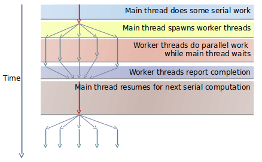
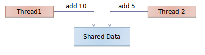

Lecture 8 - intro to Pthreads
===========
### Basics
A thread is the smallest sequence of programmed instructions that can be managed independently by a scheduler.

cooperative multithreading - run multiple threads on a single processor

Running multiple threads incurs a performance penalty due to overhead work of managing threads. It is key to figure out the point where the benefit of running more threads meets the penalty of running more threads.

Tricky Question: What is the maximum number of threads that can run in parallel in a CPU with 16 cores? 16.

### Pthreads (POSIX Threads)
Pthreads is the standardized programming interface for threading in UNIX systems

To access pthreads, you need
* import <pthread.h>
* compiler with -lpthraed or -pthread

Can get full information on them at

    https://computing.llnl.gov/tutorials/pthreads/

##### Multithreading

##### creating threads
int pthread_create(pthread_t * thread, const pthread_attr_t * attr, void * (* start_routine)(void * ), void * arg )
* thread: reference to thread handler
* attr: attribute defining thread characteristics
* start_routine: function thread should execute. Not that the function has a single argument which is void *
* arg: single argument that the function has. Again, it is of type void *
* return value of pthrea_create is 0 for success. non-zero for fail description
* attribute can be NULL. attribute is usually used for pinning a thread to a specific core  
* function to be executed by thread returns void pointer and takes only one void pointer as arg

##### Signaling thread completion
A thread can exit
* normally by simply completing the function it is supposed to complete
* by executing void pthread_exit(void * status) function. status can be NULL
* by the main thread killing it using int pthread_cancel(pthread_t thread). This is for extreme cases

##### waiting for threads completion
int pthread_join(pthread_t thread, void * status)
* thread: which thread to wait for
* status: puts threads exit status in status. can be NULL.
* return value: success/fail indicator

pthread_join is blocking.
* If the function that the thread is running terminates before join is invoked, then the control returns to the caller immediately.  
* if the function does not terminate by the time join is called, then join waits for the thread to finish

##### Thread interactions
Worker threads talk to each other. All interactions are done by having one or more threads wait for one or more threads.

A pthread mutex can be used here to make sure that the shared data is accessed one at a time - mutual exclusion.

int prthread_mutex_init(pthread_mutex * mutex, const pthread_mutexattr_t * attr)
* usually call this init function by the main thread. Call it only once.

int pthread_mutex_lock(pthread_mutex * mutex)
int pthread_mutex_unlock(pthread_mutex * mutex)
* a worker calls lock before access shared resource and calls unlock when done.
* caller waits until the mutex gets unlocked if it was not already unlocked

all render threads must wait for the communication thread to retrieve webpage contents. In order to do this, you can use a Pthread condition variable along with a mutex.

int pthread_cond_wait (
	pthread_cond_t*  condition,   
	pthread_mutex_t* mutex
)
* condition wait call blocks until condition is signaled

int pthread_cond_signal (pthread_cond_t*  condition)  
* a condition signal only unblocks one waiting thread

int pthread_cond_broadcast (pthread_cond_t*  condition)
* broadcast releases all waiting threads

TODO: http://stackoverflow.com/questions/1136371/pthread-and-wait-conditions

TODO: write a usage example

A semaphore can be used to make sure that consumer is run only when the producer is not putting an item in the queue.

int sem_init(
	sem_t* semaphore
	int pshared,
	unsigned int initial_value,
)
* if pshared=0, then semaphore is shared between threads only. If pshared!=0, then semaphore is shared between processes.

int sem_wait(sem_t* semaphore)
* wait blocks the calling thread if the semaphore value is 0 or less.
* wait decreases the value of the semaphore by 1 if value is greater than 0

int sem_post(sem_t* semaphore)
* increases the value of the semaphore by 1.
* If value was previously 0, then wakes up a waiting thread

##### Thread primitives
The few primitives of thread synchronization are used to build a larger array of synchronization data structures.
The primitives are
* mutex
* condition variables
* semaphore

The advanced data types are
* barriers
* locks

##### Barrier
Used if you need to wait for a group of threads to reach a specific stage before proceeding further

##### Read-Write lock
multiple reader threads can go at once but only one writer can write and at the time of writing, all readers must wait.
