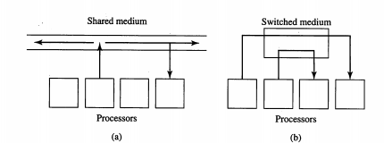

Quinn ch2 - Parallel Architectures
=============================
Is it better to have general purpose CPUs or custom processors? Is it better to have a few really powerful processors or a bunch of commodity CPUs?

It is better to have a few really powerful, but general purpose CPUs.

Why? General purpose CPUs made lots of performance gains which custom CPUs could not keep up with. A few really powerful processors do not have to deal with the redundancy that comes with have a large number of smaller processors.

### Interconnection Networks
Interconnection networks allow processors to access shared memory or to send messages to each other.

##### Shared versus Switched Media
Processors in a parallel computer may communicate over a shared or a switched interconnection medium.

A *shared medium*
* allows only one message to be sent at a time.
* Processors broadcast their messages over the medium.
* Each processor "listens" to *every* message and receives the ones for which it is the destination.
* Arbitration for access to a shared medium is decentralized. This means that the decision to determine which processor gets to use the shared device is determined by numerous different processors coming to a conclusion together. There is no master processor that controls access to the shared medium.

Before sending a message a processor "listens" until the medium is unused, then attempts to send its message. If two processors attempt to send the messages simultaneously, then the messages are garbled and must be resent. Thus the processor waits a random amount of time and then tries to send the message again. Thus *message collisions can significantly degrade performance of a heavily utilized shared medium*.

A good example of a shared medium is ethernet.

A *switched medium*
* supports point-to-point messages among pairs of processors.
* Each processor has its own communication path to the switch.
* Supports the concurrent transmission of multiple messages among different pairs of processors.
* Supports scaling of interconnection network to accommodate greater number of processors.

Key differences between the two are:
* Shared allows only one message at a time, while switched allows multiple messages to be sent across different pairs of processes.
* Switched medium is scalable with the increasing number of processors.

##### Switch Network Topologies
A switch network can be represented by a graph in which
* nodes represent processors and switches
* edges represent communication paths
*Each processor is connected to one switch*. *Switches connect processors and/or other switches*.

In *direct topology*, the ratio of switch nodes to processor nodes is 1:1. Every switch node is connected to one processor node and one or more other switch nodes.

In *indirect topology*, ratio of switch nodes to processor nodes is greater than 1:1. Thus there are more switches than processors. Numerous switches connect to only other switches.

You need to evaluate network topologies to determine their effectiveness in implementing efficient parallel algorithms. The criteria to evaluate are:
* *Diameter* - largest distance between two switch nodes. Low diameter is better because the diameter puts a lower bound on the complexity of parallel algorithms requiring communication between arbitrary pairs of nodes.
* *Bisection Width* - if you decide to cut a network into two halves, you want to cut so that you properly divide the network into the two halves using the minimum number of edges. Remember that the max-flow min-cut theorem means that the maximum network flow = min-cut. Thus, bisection width simply is a way for me to determine the maximum network flow. I want maximum network flow and thus I want maximum bisection width.
  * Another way to think about this is that the given more edges between the various parts of a large graph, the more ways a large data set can transfer information.  
  * Determining bisection width is difficult.
* *Edges per switch Node* - it is best if the edges per switch node is a constant independent of network size because then the processor organization scales more easily with larger amounts of node.
* *Constant edge length* - It is best if the maximum edge length is a constant independent of network size. This allows for easier scalability.

##### 2D Mesh Network
2D mesh network is a direct topology in which switches are arranged into 2D lattice.

Note the squares are processors and circles are switches. This is a direct topology because each switch is connected to at least 1 processor.

Evaluating this network using the 4 criterion:
* Diameter, bisection width - assume that a mesh has n switch nodes. For the non-wraparound (left) network, the minimum diameter and maximum bisection width occurs when it is a square. The diameter and bisection width are both O(√n) (if n=16, then an edge of the square is √16=4).
  * For the wraparound (right) network, the diameter gets cut in half since you can just wrap around to get a further switch. Thus the diameter becomes O(√n / 2)
  * For the wraparound network, the bisection width gets double because of the wraparound links. Thus the bisection width is O(2 * √n )
* Edges per switch Node - this is not constant in the non-wraparoud network (bad), but it is constant in the wraparound network (good. All switches have 5 links).
* Constant edge length - The edge length is variable in both pics (bad).

##### Binary Tree Network

Note that the circles are switches and the squares are processors. Thus the switches are actually arranged as a tree, and the the processors simply attach to the leaves of the tree.

Firstly, to simplify my life, note a few rules about binary trees:
* given n nodes, l leaves, and h height
* n <= 2^(h+1)-1
* l = (n+1)/2
* l <= 2^h
  * because
  * l = (n+1)/2 thus 2l-1 = n
  * substituting n, 2l-1 <= 2^(h+1)
  * which reduces to l<=2^h

Now, note that the tree itself is entirely just switch nodes. The processors are just attached to the leaves of the tree. Thus the number of processors is simply the number of leaves of the tree. I will use n, l, and h just the same as above. p = number of processors. p=l.

Given p processor nodes, a few things we know based on the properties of a binary tree are:
* the number of processor nodes is p=l=2^h
* there are n=2l-1=2p-1 switches in this tree

This is an *indirect* topology because multiple switches are not connected to any processors.  

Evaluating this network using the 4 criterion:
* Diameter- The distance between the root and a leaf is 2*log2(n)
* Edges per switch Node - this is not constant in the non-wraparoud network (bad), but it is constant in the wraparound network (good. All switches have 5 links).
* Constant edge length - The edge length is variable in both pics (bad).

##### Hypertree Network
##### Butterfly Network
##### Hypercube Network
##### Shuffle-Exchange Network

### Parallel Hardware (from class)
*Interconnection Networks* connect processors to shared memory and to each other. There are two key types - *shared medium* and *switch medium*.

Shared medium is when you share resources. Some key features of it are:
* collisions require not sending the message
* only 1 message is sent at a time
* message is overbroadcasted
* each process listens to each message
* arbitration is decentralized

Switch medium is when you send multiple message at one time. Some key features of it are:
* point-to-point messages between pairs of processors
