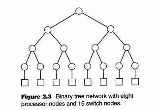
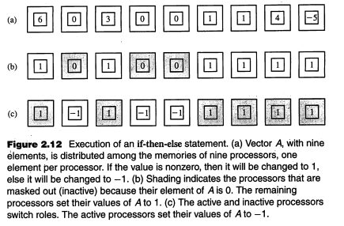
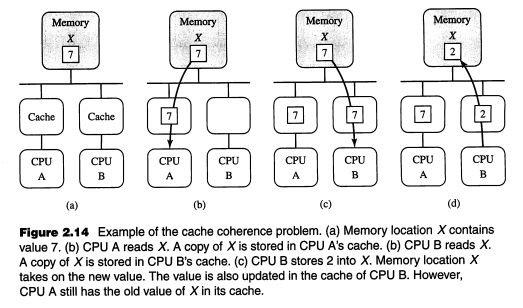

Quinn ch2 - Parallel Architectures
=============================
Is it better to have general purpose CPUs or custom processors? Is it better to have a few really powerful processors or a bunch of commodity CPUs?

It is better to have a few really powerful, but general purpose CPUs.

Why? General purpose CPUs made lots of performance gains which custom CPUs could not keep up with. A few really powerful processors do not have to deal with the redundancy that comes with have a large number of smaller processors.

### Interconnection Networks
Interconnection networks allow processors to access shared memory or to send messages to each other.

##### Shared versus Switched Media
Processors in a parallel computer may communicate over a shared or a switched interconnection medium.

A *shared medium*
* allows only one message to be sent at a time.
* Processors broadcast their messages over the medium.
* Each processor "listens" to *every* message and receives the ones for which it is the destination.
* Arbitration for access to a shared medium is decentralized. This means that the decision to determine which processor gets to use the shared device is determined by numerous different processors coming to a conclusion together. There is no master processor that controls access to the shared medium.

Before sending a message a processor "listens" until the medium is unused, then attempts to send its message. If two processors attempt to send the messages simultaneously, then the messages are garbled and must be resent. Thus the processor waits a random amount of time and then tries to send the message again. Thus *message collisions can significantly degrade performance of a heavily utilized shared medium*.

A good example of a shared medium is ethernet.

A *switched medium*
* supports point-to-point messages among pairs of processors.
* Each processor has its own communication path to the switch.
* Supports the concurrent transmission of multiple messages among different pairs of processors.
* Supports scaling of interconnection network to accommodate greater number of processors.

Key differences between the two are:
* Shared allows only one message at a time, while switched allows multiple messages to be sent across different pairs of processes.
* Switched medium is scalable with the increasing number of processors.

##### Switch Network Topologies
A switch network can be represented by a graph in which
* nodes represent processors and switches
* edges represent communication paths
*Each processor is connected to one switch*. *Switches connect processors and/or other switches*.

In *direct topology*, the ratio of switch nodes to processor nodes is 1:1. Every switch node is connected to one processor node and one or more other switch nodes.

In *indirect topology*, ratio of switch nodes to processor nodes is greater than 1:1. Thus there are more switches than processors. Numerous switches connect to only other switches.

You need to evaluate network topologies to determine their effectiveness in implementing efficient parallel algorithms. The criteria to evaluate are:
* *Diameter* - largest distance between two switch nodes. Low diameter is better because the diameter puts a lower bound on the complexity of parallel algorithms requiring communication between arbitrary pairs of nodes.
* *Bisection Width* - if you decide to cut a network into two halves, you want to cut so that you properly divide the network into the two halves using the minimum number of edges. Remember that the max-flow min-cut theorem means that the maximum network flow = min-cut. Thus, bisection width simply is a way for me to determine the maximum network flow. I want maximum network flow and thus I want maximum bisection width.
  * Another way to think about this is that the given more edges between the various parts of a large graph, the more ways a large data set can transfer information.  
  * Determining bisection width is difficult.
* *Edges per switch Node* - it is best if the edges per switch node is a constant independent of network size because then the processor organization scales more easily with larger amounts of node.
* *Constant edge length* - It is best if the maximum edge length is a constant independent of network size. This allows for easier scalability.

##### 2D Mesh Network
2D mesh network is a direct topology in which switches are arranged into 2D lattice.

Note the squares are processors and circles are switches. This is a direct topology because each switch is connected to at least 1 processor.

Evaluating this network using the 4 criterion:
* Diameter, bisection width - assume that a mesh has n switch nodes. For the non-wraparound (left) network, the minimum diameter and maximum bisection width occurs when it is a square. The diameter and bisection width are both O(√n) (if n=16, then an edge of the square is √16=4).
  * For the wraparound (right) network, the diameter gets cut in half since you can just wrap around to get a further switch. Thus the diameter becomes O(√n / 2)
  * For the wraparound network, the bisection width gets double because of the wraparound links. Thus the bisection width is O(2 * √n )
* Edges per switch Node - this is not constant in the non-wraparoud network (bad), but it is constant in the wraparound network (good. All switches have 5 links).
* Constant edge length - The edge length is variable in both pics (bad).

##### Binary Tree Network

Note that the circles are switches and the squares are processors. Thus the switches are actually arranged as a tree, and the the processors simply attach to the leaves of the tree.

Firstly, to simplify my life, note a few rules about binary trees:
* given n nodes, l leaves, and h height
* n <= 2^(h+1)-1
* l = (n+1)/2
* l <= 2^h
  * because
  * l = (n+1)/2 thus 2l-1 = n
  * substituting n, 2l-1 <= 2^(h+1)
  * which reduces to l<=2^h

Now, note that the tree itself is entirely just switch nodes. The processors are just attached to the leaves of the tree. Thus the number of processors is simply the number of leaves of the tree. I will use n, l, and h just the same as above. p = number of processors. p=l.

Given p processor nodes, a few things we know based on the properties of a binary tree are:
* the number of processor nodes is p=l=2^h
* there are n=2l-1=2p-1 switches in this tree

This is an *indirect* topology because multiple switches are not connected to any processors.  

Evaluating this network using the 4 criterion:
* Diameter- The distance between the root and a leaf is 2*log2(l). This is small. This is good.
  * this distance would be height + num_leaves which is log2(l) + l
  * l = 2^h -> h = log2(l)
* bisection width -  1 because you can split near the root. This is super good.
* Edges per switch Node - Not constant, but there is a very clear system.
* Constant edge length - no. this is bad.

##### Hypertree Network

Indirect topology

This is like a binary tree but has degree(number of children a node has) k and depth d.

Evaluating this network using the 4 criterion:
* Diameter- diameter is 2d.
* bisection width -  2^(d+1)
* Edges per switch Node - k children + num_parents. not constant.
* Constant edge length - no. maximum edge length increases with the network size.

##### Butterfly Network

Indirect topology.
Each row is called a rank. Each rank contains n nodes.

To route a message from a processor to another:
* each switch picks off the lead bit from a message
* if the bit is 0, send the remaining bits down the left link.
* if the bit is 1, send the remaining bits down the right link.

Evaluating this network using the 4 criterion:
* Diameter- log2(n)  - this is basically the height of going from the top to the bottom of the network
* bisection width -  n/2 since you just have to cut the switches in the middle
* Edges per switch Node - varies. It increases with the number of network nodes.
* Constant edge length - no. maximum edge length increases with the network size.

##### Hypercube Network (Binary N-Cube)

##### Shuffle-Exchange Network

### Processor Arrays
Vector computer is a computer whose instruction set includes operations on vectors as well as scalars. There are two ways to implement a vector computer - *pipelined vector processor* and *processor array*.

A pipelined vector processor streams vectors from memory to the CPU. Pipelined arithmetic units then manipulate them.

The other way to implement a vector computer is via a processor array. A processor array is a sequential computer connected to a set of identical, synchronized processing elements capable of performing the same operation on different data.

Note that this section is entirely on processor arrays, as the pipelined vector processors are no longer used.

##### Architecture and Data-parallel Operations
A key concept in processor arrays is that there are lots of operations that can be done in parallel since you are basically performing the same operation on a large vector of data.

A generic processor array has a front-end computer. This front-end computer has
* single processor
* primary memory contains instructions being executed and data that is manipulated sequentially by front end.
* IO processors that connect to IO devices

The key part of the processor array system is the actual processor array. The front-end computer communicates with the processor array via the CPU. The processor array then executes the instructions in parallel using the operands stored in their local memory. A control path allows the the front end computer to broadcast instruction to the back end processors.  

The Processor array has many primitive processors (P). Each processor has its own memory (M).

An example of this is summing two arrays of length 1024. Assume that there are 1024 processors. The front-end computer would have the two arrays in memory. It would send the data to the processor array to sum. Each processor would load and execute a single addition instruction for its index in the array. The two numbers to sum would be stored in each processors individual memory. The result would then be collected and sent back to the front-end.

Note that in this system, summing 100 elements vs 1024 elements takes the same amount of time. If you are off by just 1 (eg summing 1025) elements, it will take double the time.

##### Processor Array Performance
Performance is work per time unit. We measure processor array performance in terms of operations per second. Optimal performance is attained when the size of the data being manipulated is a multiple of the number of processors.

##### Processor Interconnection Network
Sometimes you need to use the result of a calculation to perform your entire expression. The processor array has a interconnection network that allows you to pass the results of calculations to each other.

The common interconnection network is a 2d mesh. This allows you to send messages concurrently.

##### Enabling and Disabling Processors
Processors in the Processor Array all are synchronized - they all perform computations together. However, this can be a waste if your array is not long enough for the entire processors array.

In order to counteract this issue, each processor has a masking bit that allows it to "opt-out" of performing an instruction.

Masking also allows for conditionally executed parallel operations. For example:

This example shows how a simple if then statement would work in a parallel process.

    if(arr[i]!=0){
      arr[i] = 1
    } else {
      arr[i] = -1
    }

The original data is in (a). Each of the 9 processors has information about its element in the array. In the first use of the processors, all the non-zero elements do their work. All the zero elements are masked. In the second use of the processor, all the zero elements are turned into -1 and all the non-zero elements are masked.

Note that because of this, executing parallel code with if statements can significantly slow down code. This is so significant that when you understand the full performance of a system running an if-then-else clause, it ends up having less than half the performance of running the same code without an if-then-else clause. It is **very slow** to put conditional statements in a parallel machine.

##### Additional Architectural Features
A data path allows the front-end computer to access individual memory locations in the processor array. This allows you to define parts parallel elements in the sequential code.

A global result mechanism allows you combine and return values from the processor array. A key part of this is that this allows you to do a global *AND* operation. You can run a bunch of jobs and at the end do a global AND operation. If the AND results in a 1, then it means all processes were successful. If not, you should either wait for all processes to finish or fix some error.  

##### Shortcomings of processor arrays
1. many problems do not map well to strict data-parallel solutions
2. if-then-else statements slow down the effectiveness of the parallel processors
3. processor arrays are most naturally single-user systems. They do not support multiple users easily.  
4. do not scale down. For example a high performing communication network is required. The cost of this is cheap when compared to the multiple processors in a large system, but expensive if you compare it to only a few processors. Processor arrays are made to work with large data sets.
5. processor arrays are built using custom VLSI which cannot keep pace with the performance improvement of commodity CPUs.
6. the cost of CPUs is not super expensive nowadays like it was when processor arrays were first used.

For these reasons, **processor arrays are no longer considered a viable option for general-purpose parallel computing**.

### Multiprocessors
A multiprocessor is a multiple-CPU computer with shared memory. The same address on two different CPUS refers to the same memory location.

Multiprocessors are better than processor arrays in that:
* they can be build out of commodity hardware
* naturally support multiple users
* do not lose efficiency when encountering conditional code while executing code in parallel

##### Centralized Multiprocessors

centralized multiprocessors are like uniprocessors but have additional CPUs added onto the bus. All processors share primary memory. This architecture is called *uniform memory access (UMA)* or a *symmetric multiprocessor (SMP)* because all the memory is in one place and has the same access time from every processor.

Centralized multiprocessors have the benefit of large and efficient caches. Having this cache allows multiple processors to share the bus and memory more efficiently.

The idea here is basically that each processors has its own *private data* to use, and also has access to *shared data*. This shared data is used to communicate with each other.

There are two key problems to solve with centralized multi-processors - *cache coherence problem* and *synchronization*.

*Cache Coherence Problem*  
Replicating data across multiple caches reduces contention among processors for shared data. However, each processors has its own view of memory through cache thus you have to make sure that each view is the same as what is actually in memory.

This image shows how this problem can occur. A wrote to memory and then B received from memory. By now, both A and B are using cache in order to figure out what is in memory. Now, when B writes to cache which writes to memory, B is okay. But, A still thinks memory has a 7. This is bad.

A solution to the cache coherence problem is called *"snooping."*  Snooping refers to a set of protocols which basically makes the cache monitor the bus to see which cache blocks are being requested. If a cache block requested is the one that the current cache uses, then the current cache block invalidates its cache. Thus the next time someone wants to use this cache, it will require this cache to go into memory.

In effect, this snooping strategy is basically giving exclusive access to a memory spot to a specific cache. If this cache block tries to write to  

### Parallel Hardware (from class)
*Interconnection Networks* connect processors to shared memory and to each other. There are two key types - *shared medium* and *switch medium*.

Shared medium is when you share resources. Some key features of it are:
* collisions require not sending the message
* only 1 message is sent at a time
* messages are over-broadcasted
* each process listens to each message
* arbitration is decentralized

Switch medium is when you send multiple message at one time. Some key features of it are:
* point-to-point messages between pairs of processors
