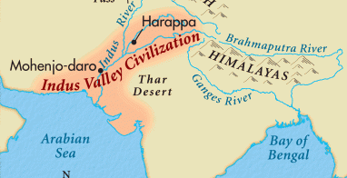

Overview of the History of the Indian subcontinent
===================================================

### Timeline

The history of the Indian subcontinent can be divided into 6 time periods
* early complex societies (3500-2000 BCE)
* Ancient Civilizations (2000-500 BCE)
* Classical Civilizations (500 BCE - 500 CE)
* Post-Classical Civilizations (500-1000 CE)
* Transregional Nomadic Empires (1000-1500 CE)
* Modern Age (1500-present)

### Early Complex Societies (3500-2000 BCE)

##### Stone Age
The earliest Homo erectus remains were found in the Narmada Valley in central India. They date back to 500,000 - 200,000 years ago. This is called the Middle Pleistocene era.

The first confirmed semipermanent settlements appeared 9,000 years ago in Bhimbetka rock shelters in Madhya Pradesh.

Agriculture cultures sprang up
* in Indus Valley region around 5000 BCE
* lower Gangetic valley in 3000 BCE
* southern India

This early civilization spread northwards to Malwa around 1800 BCE and also spread southwards

Locations:
* Indus Valley Civilization is in northwest India (border of India/Pakistan)
* Ganges River is in Northeast India

##### Indus Valley Civilization

The Indus Valley Civilization was centered around the Indus River during 3300 - 1900 BCE. The people were called Harappans.

It's main locations were
* modern day Gujurat, Haryana, Punjab, and Rajasthan
* modern day Pakistan

The key urban centers were
* Dholavira, Kalibangan, Ropar, Rakhigarhi, and Lothal in modern-day India
* Harappa, Ganeriwala, and Mohenjo-daro in modern-day Pakistan

It's key features were
* bronze age
* cities built with rock
* roadside drainage system
* multistoried houses
* municipal system

The civilization started to gradually decline around 1700 BCE. It is unclear why. The cities were simply abandoned overtime. 
