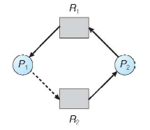
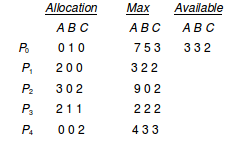

Deadlocks
==========
Resources are things that a thread would use. Each resource R has W instances. A thread processes a resources by
  1. requesting the resource
  2. using the resource
  3. releasing the resource

### 4 conditions that MUST be true for a deadlock to occur
* Mutual exclusion - only one process at a time can use a resource
* Hold and wait - while a process holds a resource, it is also waiting to acquire additional resources
* No preemption -  a resource can be released only voluntarily by the process holding it, after that process has completed its task
* Circular wait - P0 is waiting for P1, P1 is waiting for P2, P2 is waiting for P0.

### Resource-Allocation Graph

  * this graph has a deadlock
  * Mutual Exlcusion: assume true
  * Hold and wait:
    * P1 holds R2 and is waiting for R1.
    * P2 holds R1 and R2 and is waiting for R3
    * P3 holds R3, and is waiting for R2
  * No Preemption: assume true
  * Circular Wait:
      * P1 is waiting for P2
      * P2 is waiting for P3
      * P3 is waiting for P1

  * no deadlock, even though there is a Circular wait
  * Assume mutual exclusion and no preemption
  * hold and wait:
    * P1 is waiting for R1 and holds R2
    * P3 is waiting for R2 and holds R1
  * circular wait:
    * P1 is waiting for P3
    * P3 is waiting for P1
  * THUS, the 4 conditions of Deadlock are TRUE. HOWEVER, still no deadlock. Thus, the 4 conditions are necessary for a deadlock, but DO NOT imply deadlock.

### Key Hints
If graph has no cycles -> no deadlock

if graph contains a cycle ->
  * if only 1 instance per resource type -> deadlock
  * if several instances per resource type -> potential for deadlock

### Handling Deadlocks
You can ensure that a Deadlock never occurs via *deadlock prevention* techniques or *deadlock avoidance* techniques.

You can recover from a deadlock

You can just pretend that a deadlock will never occur. Most OS's do this. Unix does this. This is cray-cray.

### Deadlock Prevention
You can restrain the ways a request n be made. The way to go about this is to make any one of the 4 necessary conditions for deadlocks be false.
  * mutual exclusion
    * for shareable resources, you don't need mutual exclusion. shareable resources are basically read-only resources
  * hold and wait
    * guarantee that whenever a process requests a resource, it is not already holding any resources
    * make it so that a process requests all its resources before executing anything and that it releases them at the end
      * problem with this is that if there is a small amount of total resources, then you can have starvation(a process waits indefinitely because it doesn't stop waiting for resources)
  * no preemption
    * if a process is running and needs to wait on some resource, it releases ALL of its currently held resources. It thus is now waiting for ALL of the resources it needs (both the ones it still needs and the ones it just releassed). You only restart the process when ALL of the resources it needs are available.
  * circular wait
    * impose a total ordering of all resource types. This means that whenever a process requests resources, it MUST request them and release in some predetermined order.
      * NOTE: this is the EASIEST thing to do

### example of deadlock in code

    // thread one runs in this function
    void * do_work_one(void * param) {
      pthread_mutex_lock(&first_mutex);
      pthread_mutex_lock(&second_mutex);
      // Do some work
      pthread_mutex_unlock(&second_mutex);
      pthread_mutex_unlock(&first_mutex);
      pthread_exit(0);
    }

    // thread two runs in this function
    void * do_work_two(void * param){
      pthread_mutex_lock(&second_mutex);
      pthread_mutex_lock(&first_mutex);
      // Do some work
      pthread_mutex_unlock(&first_mutex);
      pthread_mutex_unlock(&second_mutex);
      pthread_exit(0);
    }
* mutual exclusion - done by the fact that you lock mutexes before doing work
* hold and wait - each process has a mutex and also waits for another mutex
* no preemption - process 1 does not force process 2 to release resources. Or vice versa.
* circular wait - p1 waits on p2. p2 waits on p1.

### deadlock example with lock ordering

    void transaction(Account from, Account to, double amount){
       mutex lock1, lock2;
       lock1 = get_lock(from);
       lock2 = get_lock(to);
       acquire(lock1);
          acquire(lock2);
             withdraw(from, amount);
             deposit(to, amount);
          release(lock2);
       release(lock1);
    }

you can have deadlocks within a **single** process simply because you reverse the order of locks

In the above code, you can have 2 processes both running the same transaction code and have a deadlock. If process1 transfers from account A to B and process2 transfers from B to A then you will have deadlock.

### Deadlock Avoidance
Each process has a max number of resources it needs and currently used resources. You want to schedule giving resources to make sure you are always in a 'safe state'

A 'safe state' is when
  1. you have a sequence of processes
    * this sequence MUST include ALL of the processes in the system
  2. you go through the sequence of processes
    * you have enough resources to allocate to max amount of resources that that process can ask for
    * you collect the resources when that process is done
    * you have enough resources for the next process
    * this must be true for ALL of the processes in the sequence

If you are in a safe state, you want to make sure you remain in a safe state.

If you are in unsafe state, then you can potentially enter deadlock. Thus avoid unsafe states.

Thus deadlock avoidance is done simply by avoiding unsafe states.

### Avoidance algorithms
If you have a single instance of a resource, then you can use resource-allocation graph algorithm

If you have multiple instances of a resource type, you can use the bankers algorithm

### Resource-Allocation graph algorithm for deadlock avoidance
You use the same resource allocation graph as mentioned above, but add a **claim edge** to it. A claim edge is when a process may request a resource.

When the process actually requests the resource, it turns into a request edge. When the process request leads to the process allocating the resource, it turns into assignment edge (reverse direction of line).

  * unsafe state in resource-allocation graph
  * all this algorithm does is avoid cycles. Thus in the current configuration, the algorithm will not allocate resource 2 to process 1 because it leads to a cycle.

### Banker's Algorithm
If you have multiple instances of a resource type, you can use the bankers algorithm

Each process must beforehand tell you how many resources it may have to wait for.

When a process gets all its resources, it must return them in a finite amount of time.

You basically keep track of
  * the number of available resources of each type
  * the maximum amount of resources of each type for each process
  * the number of resources allocated of each type for each process
  * the number of resources of each type still needed for each process

need = max - allocated for a specific type of resource for a given process

The sequence <P1, P3, P4, P0, P2> is in safe state since
  * it contains all the processes in the system
  * i can go in the order defined by the sequence and make sure that I have enough resources to satisfy a maximum request by the current process in the sequence.
    * note: i may have to collect resources from done processes
    * note: because there are multiple types of resources (A, B, C), I have to make sure that there are enough resources for all three types

### Deadlock Detection

  * can create a wait-for graph from a resource allocation graph
    * wait-for graph simply says that P1 is waiting for P2.
  * if there is a cycle in the wait-for graph, then there is a deadlock

The algorithm is to simply check the wait-for graph periodically. If the graph has cycles, then deadlock.
