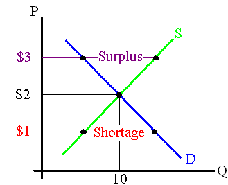

Supply and Demand
==================

Market is any place where buyers and sellers meet to exchange goods.

P=price per unit of item
Q=number of items
D=demand curve. If Price goes up, buyers will buy less of the item.
S=supply curve. If price goes up, creators will create more of item.
At $3, supplier want to make a lot, but buyers don't want too much of the good. Thus Surplus of good is made.
At $1, supplier doesn't want to make good, but buyer badly wants to buy it. Thus shortage.
At $2, equilibrium. Both supplier and buyer are happy

Supply curve shifts left when
* it becomes harder to make good

Supply curve shifts right when
* it becomes easier to make good

Demand curve shifts left when
* less people want item 

Demand curve shifts right when
* more people want item
