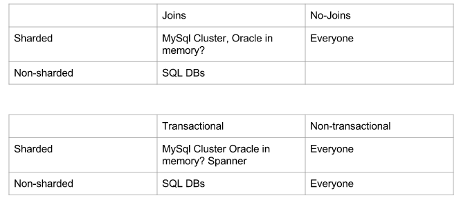

Lecture 6 - Databases, pt2
============================

### Types of solutions

sharded - how split apart the database is

### SQL vs NoSQL
SQL is a query language

### Sharding
Sharding is dividing data across many machines

Clients need strategy to know which machines store which data
  * fixed mapping, hashing

Want to avoid "hot spots" by sending equal load to all shards
  * eg. make sure highly accessed users/listings on different shards

The image is a sample partitioning system to determine which data is on which shard.

Problems can occur
* different clients have different idea of what machine to use

### Locking / Transactions
Ensure consistency by making sure sets of updates are ACID.
  * ACID: Atomic, Consistent, Isolated, Durable
  * Atomic - change occurs or does not occur. No in between.
  * Consistent - only valid data is written to db. If a transaction is executed that violates the db consistency rules, the entire transaction will be rolled back.
  * Isolated - multiple transactions occurring at the same time cannot impact each others execution. If two transactions come at the same time and affect the same time, then the transactions should be done sequentially.
  * Durable - any transaction committed to the database will not be lost. This is done via backups and transaction logs that restore committed transactions in the case of software or hardware failures

Usually enforced by locking rows that are affected by query/update
* locks out other users so lowers performance

### Replication
make copies of data

techniques to keep copies in sync
  * block reads until all copied data is updated
  * allow low consistency reads

### Columnar databases
Columnar Databases: store columns contiguously thus scanning multiple columns
