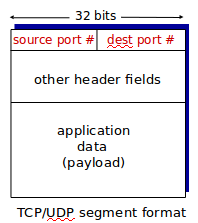

Transport Layer
================
# Transport-layer services
goal of tranport layer is to provide *logical communication* between app processes running on different hosts

the messages sent for the transport layer are called *segments*. The sender side breaks the message into segments and sends it. The receiver receives the segments turns them into messages. The receiver then passes it to the application layer.

The transport layer communicates between processes instead of between hosts

### TCP vs. UDP
TCP is
  * reliable
  * in order delivery

UDP is
  * unreliable
  * unordered delivery

# Multiplexing/Demultiplexing
multiplexing at sender:
  * handle data from multiple sockets
  * add transport header(later used for demultiplexing)

demultiplexing at receiver:
  * use header info to deliver received segments to correct socket

### demultiplexing
host recieves IP datagrams
  * each datagram has source IP and destination IP
  * each datagram carrier one transport layer segment
  * each segment has source, destination port number

### connectionless demultiplexing
there is a host port and 

# reliable data transfer
# connection-oriented Transport: TCP
# flow control
# congestion control
# UDP: connectionless transport
# TCP: connection-oriented reliable transport
# TCP Congestion Control
