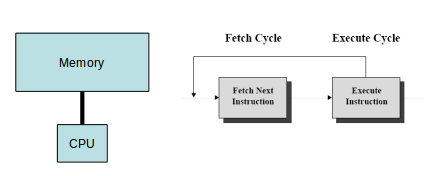
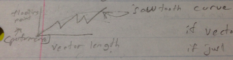

Lecture 2
===============

### Floating Point Operation per Second (FLOPS)
Modern computer has 5 to 25 giga flops
### Von Neummann machine

Von Neumann architecture is a simplified architecture with a single CPU and sequential instructions. There is also no pipelining.

It does has memory, cpu, and bus. It cycles through instructions sequentially.
##### Memory, CPU, bus, fetch cycle
Byte = 8 bits  
Memory is organized into a randomly addressable vector of bytes (RAM). A 32-bit word is 4 bytes. Most machines are 32 or 64 bit.

**word-alignment** - memory is usually addresses on word boundaries. This means that some memory could be used as just filler. For example:  

    struct Foo{
        char x; //1 byte
        int y;  //4 byte, must be word aligned
        char z; //1 byte
        int w;  //4 byte, must be word aligned
    }
This should only take 10 bytes. However, if the two ints are word aligned (assume 32 bit system thus 4 byte word), then you end up having to skip 3 bytes after the char z in order to make w word aligned. Thus as a whole, it would take 13 bytes instead of 10.

##### Memory
The memory hierarchy is:

The registers are usually under program control.  
The caches, disk memory, and external memory are usually under programmer control.

As you go down the memory hierarchy, things get monetarily cheaper and slower.

Typical numbers for a 3 GHz processor:
* cycle (register) time is 1/3 ns
* L1 cache access is 2-3 ns
* L2 cache access is 20-50 ns
* main memory is 60-100 ns
* disk is 5 x10^6 ns to 12 x  10^6 ns

Note the key jumps - register and caches are fairly similar, but then main memory is 100x faster than register. And then the HUGE difference is main memory and disk which is x100000!!! Basically, there is a HUGE difference between running a movie from memory and from disk.

Note also that the clock cycles have a upper bound - speed of light (299,792,458m/s)

★ Having multiple processors can also slow down memory access because
* only 1 thing can be on a bus at one time, thus the pathway to memory system gets clogged.
* a process accesses some memory and then stores it in cache, but then when another process runs it totally changes cache and so its like the old cache never existed

For these reasons, the most important lesson is to manage memory.

### Distributed machines
Distributed machines usually have numerous nodes all connected to a interconnection network. The interconnection network is how the nodes all share memory. Each node itself has its own cores and CPUs. In fact, the nodes themselves are usually have multiple cores.
### Vector machines
Vector machines have
* registers that can store vectors
* accesses entire vectors from registers/memory at once
* computations that are done on vectors in a single cycle

The picture above is a sawtooth curve. As you increase the vector length of the registers, the performance increases but not linearly. If the length of your array is the same as the vector length of the registers, then you get the best performance. This is the peaks of the curve. If you are off by just one, then your performance is very bad and your at the troughs of the curve.

### Floating Point

floating point systems have nonuniform number representation - there are varying densities of number that can be represented on the number line. For example, there are more numbers closer to 0 that can be represented by floating point than numbers that are farther away from 0.

Thus there are an infinite number within [min, max] that are not representable.
### Sources of Error
Common sources of error include:
* overflow  - numbers > max
* underflow - number too close to 0 to be represented by floating point
* discretization -  turning or treating floating point numbers into integers
* rounding during operations
* loss of precision
* cancellation

###### cancellation
cancellation is when you subtract two floating point numbers that have many identical digits. The identical digits are canceled and the resulting number has fewer significant digits than either of the operands. Later on, when using this number with another calculation, you have changed the sig figs. For example,   
1.613637 (7 sig figs) - 1.613645 (7) = 0.000012 (2)

Now, when I try to do  
1.999999999 (10) - result(2), I get 1.9 because there is only 2 sig figs in the result. In reality, I should be getting a 7 sig fig answer, but the computer doesn't know that.

### Optimization & timing
When giving timing information about a program, you always want to give metadata along with it. This metadata should include
* hardware
* compiler
* input data set
* cache
* test cases
* compiler flags
* motherboard
* load on machine
* time of day program is run

The load on a machine is the number of processes running on the machine. If you have 8 cores and 5 cores being used then a new process will automatically just use one of the three unused cores. However, if you have 8 cores and 9 processes already being run, then a new process will have to wait for something to finish before it can be run on a core.

##### Cool timing commands
* uptime
  * gives you load on a unix machine
* time <cmd>
  * gives you realtime (clock time), user time (time user spends on command), and sys time (time for given command only)
* gprof
    * profiler
    * gives you call graphs, time spent in each function, number of times each function/code is executed
    * example:
      * g++ -pg myprog.c -o myprog
