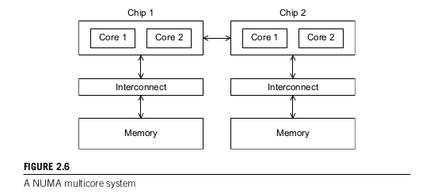
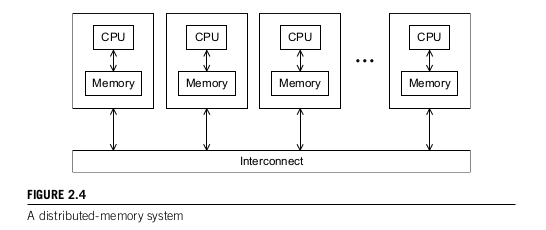

Parallel Hardware and Parallel Software
=======================================

# von Neumann architecture
This 'classical' architecture contains
* main memory,
* central processing unit (CPU) or processor or core,
* an interconnection between the memory and CPU

Main memory consists of collection of locations. Each location can store data and instructions.

CPU is divided into control unit and arithmetic and logic unit (ALU). Control unit determines which instructions to execute while the ALU actually executes the instruction.

Data in CPU and information about state of an executing program are stored in very fast storage - registers.  
Control unit has a special register called the program counter which stores the address of the next instruction to be executed.  
The interconnection is usually a bus - collection of parallel wires and some hardware controlling access to the wires. This interconnect allows you to read/fetch from memory and write/store into memory. The separation of memory and CPU is very important as it is a bottleneck in increasing performance.

# Processes, multitasking, and threads
OS manages hardware and software resources on a computer. It determines which programs can run and when they can run. It also controls allocation of memory to running programs and access to peripheral devices.

When a user runs a program, OS creates a *process* - instance of a computer program that is being executed. A process contains:
* execuatable machine language program
* block of memory that includes
  * executable code
  * call stack
  * heap
* descriptors of resources that OS has allocated to the process. For example, file descriptors
* Security information. For example, info on which hardware and software resources the process can access.
* information about the state of the process - is the process ready to run or is it waiting on some resource/register/memory.

Most modern OS's are *multitasking* - OS provides support for simultaneous execution of multiple programs.

Multitasking is possible for a system with a single core because each process runs for a small interval of time (*time slice*). After running program has executed for time slice, OS can run a different program.

*Blocking* is when a multitasking OS has a process that needs to wait for a resource and so will stop executing. While this process is stopped, the OS will run other processes.

*Threading* is a way programmers can divide their programs into more independent tasks with the property that when one thread is blocked, another thread can run. It's much faster to switch between threads than it is to switch between processes. This is because threads are "lighter weight" than processes. A thread can use the same IO devices and memory as the process. Thus sharing allows switching between threads to be faster.

If a process is the "master" thread of execution and threads are started and stopped by the process, then starting each thread is to "*fork* off the process" and to terminate the thread is to "*join* the process"

## Instruction-level parallelism

Instruction-level parallelism  attempts to run multiple processor components or *functional units* simultaneously run instructions. There are two main ways to do Instruction-level parallelism - *pipelining* and *multiple issue*.

### Pipelining
Pipelining is when you have functional units split up into stages and running them like an assembly line. Overall, a single functional unit will take longer, however, when combined with multiple others, the speed increases. Why? Because multiple stages can be done at once thus an instruction can start running before the previous instruction finishes.  

### Multiple Issue
Multiple issue is when you start multiple instructions simultaneously. Multiple issue processors replicate functional units and try to execute them simultaneously.

For example:
    for(i=0;i<1000;i++) z[i] = x[i] + y[i]
With multiple issue, you can calculate z[0] (aka the sum of x[0] and y[0]) and z[1] ( x[1]+y[1]) at the same time. Thus you end up doing two entire lines of code in the same time it normally takes to do one line of code.

If the functional units are scheduled at compile time, then a multiple issue system is using *static* multiple issue. If the functional units are schedule are run time, then the multiple issue system is using *dynamic* multiple issue. *Superscaler* = a computer architecture where several instructions are loaded at once and, as far as possible, are executed simultaneously. Dynamic multiple issue is superscaler.

In order to use multiple issue, a processor must find instructions that can be executed simultaneously. A key way to do so is through *speculation*, where you guess what instruction to run and how and if things work then yay but if things break then you need to have a strategy to fix things.

## Hardware multithreading

Hardware multithreading is just normal threads in a program. The things that are created by a process and you can have multiple threads and they can be run concurrently.

The good thing about *thread-level parallelism* is that it allows for a *courser-grained* (more general) parallelism than instruction level parallelism.

A key requirement of hardware multithreading is that you must be able to switch between threads quickly. This is the reason threads are awesome - because they are easy to switch between. This is why we run a gazillion concurrent threads more often than a gazillion concurrent processes.

Even with hardware multithreading, you can have both *fine-grained* and *course-grained* multithreading.

In *fine-grained* multithreading, the processors switches between threads after each instruction. Notably, you skip threads that are stalled. This is good because you end up skipping threads that are stalled, but bad because you have to do a context-switch to change threads after every instruction. Repeated context-switchs can in fact be slow.

In *course-grained* multithreading, you only switch threads that are stalled waiting for some super slow operation. The good thing about this approach is that you are only switching when you really need to - only switching when you have something slow running where you don't really need to sit there are wait for it to finish. The bad thing about this is that this smarter context-switching is not instantaneous to switch as it has to do work to determine whether switching is a smart idea at the current moment.

*Simultaneous multithreading* is like fine-grained multithreading but it exploits superscalar processors (several instructions loaded at once). It allows instructions from multiple threads to be run on the same cycle.

# Parallel Hardware

*Flynn's taxonomy* is used to classify computer architectures. It classifies a system according to the number of instruction streams and the number of data streams it can Simultaneously handle. A classical von Neumann system is single instruction stream, single data stream (SISD) because it executes a single instruction at a time and can fetch or store one item of data at a time.

Single instruction, multiple data (SIMD) are Parallel systems. SIMD can execute one instruction at a time but can read/write from memory multiple items of data at a time. Thus SIMD architectures have 1 control unit and multiple ALUs. The basic idea of SIMD architectures is that you apply the same instruction to multiple data items.

SIMD can be potentially wasteful. Say you have 10 data streams and a single instruction that can be running on all 10 data streams. However, you will not always need to run the instruction on all 10 data streams. Thus you have a bunch of ALU's just sitting there with nothing to do while a given instruction runs on its peer ALU's.

*data-parallelism* is when you divide data among different processors and apply the same instruction on all divisions of the data. SIMD is perfect for this at it runs a single instruction on a bunch of data streams.

Some key real world uses of SIMD architectures are with *vector processors* and *graphics processing*.

## Vector Processors

Vector Processors are processors which work on vectors (lists) of data rather than just single data units. Key characteristics of vector processors are:
* vector registers
  * registers that can store a vector of operands
  * can operate simultaneously on their contents
  * fixed vector length
* vectorized and pipelined function units
  * same operation is applied to each item in the vector
  * if operation requires multiple vectors, then the appropriate pair of items in each vector will be used.
  * SIMD since you are running single instruction on multiple data streams
* vector instructions
  * instructions that run on vectors rather than scalars (individual items). For example, if you have a loop that adds 1 to each element of an array, a normal machine will require n memory calls to get each element and then n additions and then n memory placements. With vector processors, in a *single* memory call you can get all the elements of the vector. Then, in another *single* vector instruction, you can add 1 to each element. Finally, in a *single* vector instruction you can put the entire array back into memory. Thus, you went from 3n to 3. That is a massive speedup.
* strided memory access and hardware scatter/gather
  * strided memory access means you access 1,4,7,10th elements at once.  
  * hardware scatter/gather means that you can read(gather) or write(scatter) multiple elements at the same time (just like strided memory access) except that you do not have to have a regular interval. Thus you can access 1,2,6,1003 elements at once.

## Graphics processing units
Graphics applications use points, lines, and triangles to internally represent the surface of an object. They use a *graphics processing pipeline* to convert internal representation into an array of pixels that can be sent to a computer screen.

## MIMD Systems
Multiple instruction, multiple data (MIMD) systems support multiple simultaneous instruction streams operating on multiple data streams. To allow for this, MIMD systems have multiple fully independent processing units each with its own ALUs. These systems are also usually *asynchronous* - processors can operate at their pace. In MIMD, there is no global clock. The point is that there may be no relation at all between two different processors within a MIMD system.

There are two main types of MIMD systems - *shared-memory systems* and *distributed-memory systems*.

In shared-memory systems, a collection of autonomous processors is connected to a shared memory system via an interconnection network, and each processor can access each memory location. The communication is usually done via some shared data structure.

Most common shared-memory systems use one or more *multicore* processors (processors that have multiple CPUs or cores built into a single chip). Within shared-memory systems, there are *uniform memory access (UMA)* and *nonuniform memory access (NUMA)*.

UMA systems connect all processors directly to main memory. The time to access all the memory locations is the same for all cores in this system. UMA systems are also easier to program since you don't need to worry about different access times for different memory locations.

In NUMA systems, each processor has a direct connection to a block of main memory. Special hardware has to be built in order to allow all processors to access each others blocks of memories. In this system, a memory location to which a processor is directly connected can be accesses faster by this processor than other processors. This makes it more complicated to program these machines, but you do have the benefit of knowing that some memory locations can be accesses faster.

In distribute memory systems, each processor is paired with its own private memory. The processor / memory pairs communicate with each other using a interconnection network. Thus the processor/memory pairs usually have some explicity functions or some explicit way to send messages to each other. A processor / memory pair does not have explicit access to anothers memory, however, can affect another via these message or functions.  

Most common distributed-memory systems are called *clusters*. Clusters are made of a large number of commodity systems (PCs) connected by a commodity interconnection network (ethernet). *Nodes* of these systems are usually shared-memory systems with one or more multicore processors. Shared-memory clusters are also called a *hybrid system*.

A *grid* provides cluster systems an infrastructure to turn large networks into something useful. Each individual node is very different (*heterogeneous*) and so the unifying grid is very key in turning this into a useful system.
